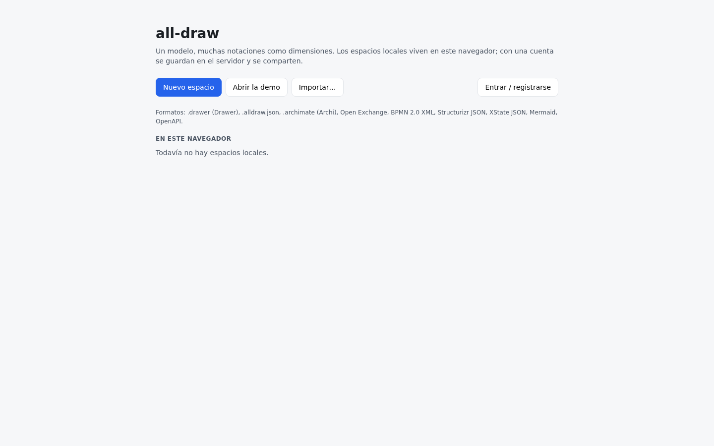
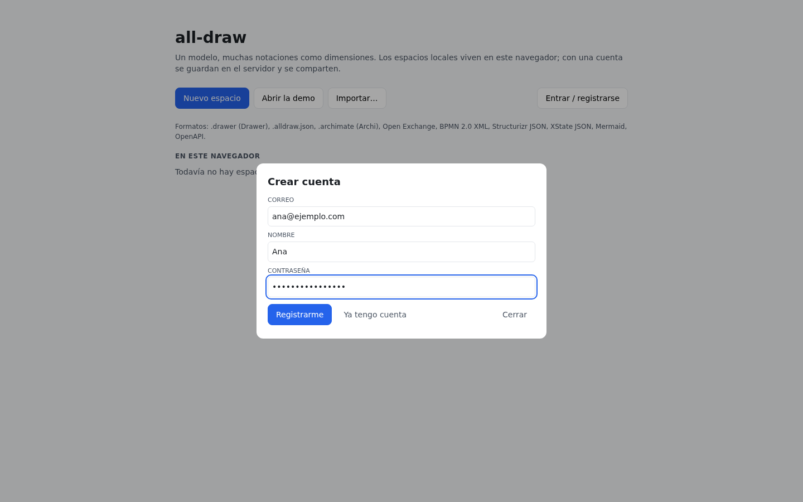

# 1. Primeros pasos

all-draw es un diagramador en el que **el modelo y las vistas están separados**: un elemento
("Alta de cliente") existe una sola vez y se dibuja en tantas vistas como quieras, cada una en
una notación distinta (ArchiMate, BPMN, máquina de estados, C4, capas × etapas…). Este manual
recorre la aplicación web tal y como está desplegada en <https://alldraw.bezenti.com>.

Capítulos: [Modelo y vistas](02-modelo-y-vistas.md) · [Editor](03-editor.md) ·
[Notaciones](04-notaciones.md) · [Librerías, reglas y personas](05-librerias-reglas-personas.md) ·
[Compartir y colaborar](06-compartir-y-colaborar.md) · [Importar y exportar](07-importar-exportar.md) ·
[Agentes y API](08-agentes-y-api.md) · [Desplegar](09-desplegar.md).

## La pantalla de inicio

Al abrir la aplicación ves tres acciones y, debajo, tus espacios:

- **Nuevo espacio**: crea un espacio vacío.
- **Abrir la demo**: crea una copia del espacio de ejemplo "Alta de cliente" (ver más abajo).
- **Importar…**: crea un espacio a partir de un fichero (`.drawer`, `.alldraw.json`, `.archimate`,
  BPMN, Structurizr, XState, Mermaid, OpenAPI…; ver [Importar y exportar](07-importar-exportar.md)).

Un **espacio** (workspace) es la unidad de trabajo: contiene el modelo, sus vistas, las
librerías, las reglas y las personas. Cada espacio se abre en el editor con su propia URL.

## Espacios locales y espacios en el servidor

| | Espacio local (`#/w/<id>`) | Espacio en el servidor (`#/s/<id>`) |
|---|---|---|
| Dónde vive | En IndexedDB de **este navegador** | En el servidor, con una copia local en el navegador |
| Necesita cuenta | No | Sí (o un enlace compartido) |
| Funciona sin conexión | Siempre | Sí: se guarda en local y se sincroniza al volver la conexión |
| Se puede compartir | No (primero hay que subirlo) | Sí: colaboradores con rol y enlaces de edición/lectura |
| Se pierde si… | Borras los datos del navegador | Lo borra el dueño |

Sin cuenta, todo lo que crees es local y aparece en la sección **En este navegador**. Puedes
trabajar así indefinidamente; la aplicación es una PWA y se puede instalar.

## Crear una cuenta

1. Pulsa **Entrar / registrarse** (arriba a la derecha; solo aparece si el servidor de cuentas
   está disponible).
2. En el diálogo, pulsa **No tengo cuenta**, rellena correo, nombre y una contraseña de al menos
   8 caracteres, y pulsa **Registrarme**.

El diálogo se cierra con **Escape** o con **Cerrar**; el foco vuelve al botón que lo abrió. Si el
correo ya existe o la contraseña es incorrecta, el error se muestra bajo los campos (y lo anuncia
el lector de pantalla).

Con la sesión iniciada:

- El botón principal pasa a ser **Nuevo espacio en el servidor** y **Abrir la demo** crea la demo
  en el servidor.
- Aparece la sección **En el servidor** con tus espacios y tu rol en cada uno (`owner`, `editor`,
  `viewer`).
- Los espacios locales muestran el botón **Subir al servidor**, que crea una copia en el servidor
  (el local sigue existiendo hasta que lo borres).
- Arriba a la derecha tienes tu nombre, el enlace **claves API** (ver
  [Agentes y API](08-agentes-y-api.md)) y **salir**.

La sesión dura 30 días. El primer usuario que se registra en un servidor es administrador.

## La demo "Alta de cliente"

La demo es el mejor sitio para entender la idea de all-draw. Modela el proceso de alta de un
cliente en un banco en **cinco dimensiones** sobre el mismo modelo (más una vista de secuencia
añadida recientemente, que aún no aparece en las capturas):

| Vista | Notación | Qué muestra |
|---|---|---|
| Arquitectura · Alta de cliente | ArchiMate 3.2 (viewpoint *Layered*) | Actor, rol, proceso, servicio, componentes, datos y nodo |
| Alta de cliente · BPMN | BPMN 2.0 | El proceso paso a paso, con pool "Banco" y dos lanes |
| Alta de cliente · Estados | Máquina de estados | El ciclo de vida del expediente |
| CRM · Contenedores | C4 | Contenedores del CRM (portal, API, base de datos) y el proveedor KYC externo |
| Alta de cliente · Secuencia | Diagrama de secuencia | Cliente, portal, API y base de datos intercambiando mensajes |
| Mapa capas × etapas | Capas × etapas | Los mismos elementos en una rejilla Negocio/Aplicación/Tecnología × Captación/Alta/Operación, con microservicios de una librería y **pines** conectados |

Abre la demo y prueba estas tres cosas:

1. **Doble clic** sobre "Alta de cliente" en la vista ArchiMate: entras en su vista de detalle
   BPMN y aparece una ruta (breadcrumb) en la barra para volver.
2. **Botón derecho** sobre cualquier nodo → *Abrir en otra dimensión*: la lista de notaciones en
   las que ese elemento ya aparece (o se puede crear).
3. En "Mapa capas × etapas", selecciona `clientes-api` y mira la pestaña **Pines** del inspector.

## Guardado

No hay botón de guardar. Cada cambio se aplica al instante en el navegador (IndexedDB) y, si el
espacio está en el servidor, se envía en cuanto hay conexión. El indicador de la barra dice
`guardado en este navegador`, `● en línea`, `◌ conectando…` o `○ sin conexión (se sincroniza al
volver)`.
