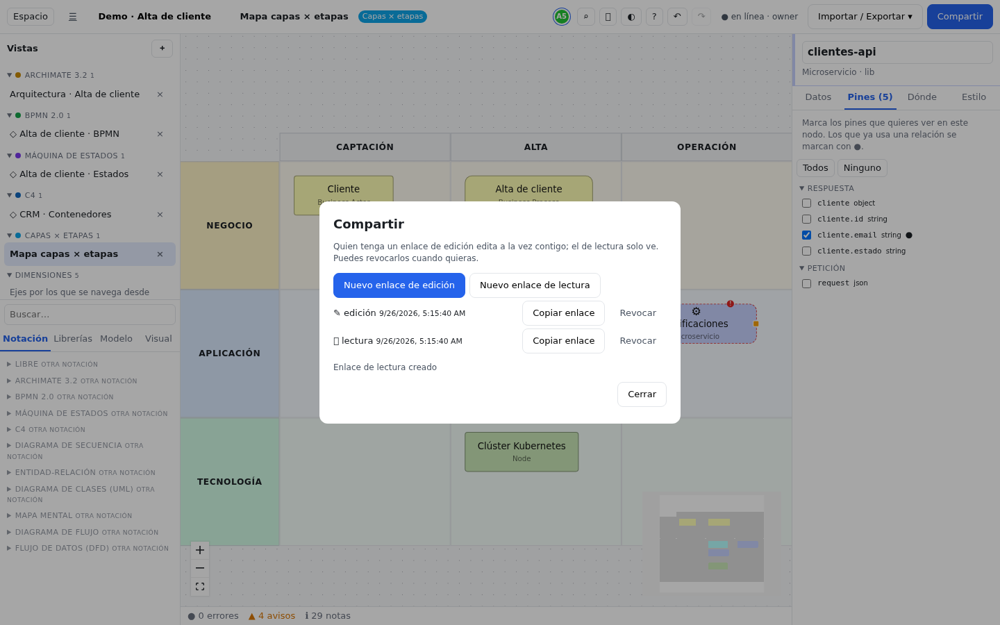

# Compartir y colaborar

En all-draw varias personas pueden trabajar a la vez sobre el mismo espacio y ver los cambios de las demás al
instante. Este capítulo explica cómo llevar un espacio al servidor, cómo invitar a otras personas, qué puede hacer
cada una y qué pasa cuando se va la conexión. Al final está la pantalla **Cuenta**, donde cambias tu contraseña y,
si administras el servidor, gestionas las cuentas.

## Local o en el servidor {#local-o-servidor}

Solo se comparten los espacios **del servidor**. Un espacio **local** vive únicamente en tu navegador.

| | Espacio local | Espacio en el servidor |
|---|---|---|
| Dónde aparece en el inicio | **En este navegador** | **En el servidor** |
| Dirección | `#/w/<id>` | `#/s/<id>` |
| Necesita cuenta | No | Sí, o un enlace compartido |
| Se puede compartir | No (antes hay que subirlo) | Sí |
| Estado en la barra | `guardado en este navegador` | `● en línea` · tu rol |

Si has entrado con tu cuenta, **Nuevo espacio en el servidor** e **Importar…** crean directamente espacios del
servidor.

## Crear una cuenta y entrar {#cuenta}

1. En el inicio, pulsa **Entrar / registrarse**.
2. Si ya tienes cuenta, escribe tu correo y contraseña y pulsa **Entrar**.
3. Si no, pulsa **No tengo cuenta**, rellena correo, nombre y una contraseña de **al menos 8 caracteres**, y pulsa
   **Registrarme**.

Según cómo esté configurado el servidor, el registro puede ser abierto, pedir un **Código de invitación** (pídeselo a
quien administre el servidor) o estar cerrado ("El registro está cerrado en este servidor"). La sesión dura 30 días
desde la última vez que usas la aplicación; para salir, pulsa **salir** junto a tu nombre en el inicio.

## Subir un espacio local al servidor {#subir}

1. Entra con tu cuenta.
2. Abre el espacio local y pulsa **Subir al servidor** en la barra del editor. También puedes hacerlo desde el
   inicio, con el botón **Subir al servidor** de ese espacio en la lista **En este navegador**.
3. Se crea una **copia** en el servidor y se abre (su dirección pasa a ser `#/s/<id>`). Tú eres su dueño.

> [!IMPORTANT]
> El espacio local original **sigue existiendo** en tu navegador y ya no está conectado a la copia del servidor. A
> partir de ahora trabaja en la copia del servidor (sección **En el servidor** del inicio) y, cuando estés seguro, borra
> la local para no confundirte.

## Roles {#roles}

Cada persona tiene un rol en cada espacio del servidor:

| Rol | Qué puede hacer |
|---|---|
| `viewer` (lector) | Ver todas las vistas, buscar, exportar, leer comentarios y seguir los cambios en directo. No puede modificar nada. |
| `editor` | Todo lo anterior y además editar: dibujar, cambiar datos, usar el panel Espacio, comentar, importar y restaurar instantáneas del historial. |
| `owner` (dueño) | Todo lo anterior y además **Compartir** (crear y revocar enlaces), borrar el espacio y borrar instantáneas. |

- El **dueño** es quien crea (o sube) el espacio.
- Los **administradores** del servidor ven todos los espacios con permisos de dueño. El primer usuario que se registra
  en un servidor es administrador.
- Tu rol aparece en la barra, junto al estado de la conexión (por ejemplo, `● en línea · editor`).

Desde la interfaz se comparte con **enlaces**. Dar un rol a una cuenta concreta (miembros) o transferir la propiedad
se hace hoy por la API (`PUT /api/workspaces/:id/members/:userId` con `{ "role": "editor" }`); ver
[Agentes y API](agentes-y-api.md).

## Invitar a alguien {#invitar}

Solo el dueño ve el botón **Compartir**.

1. Abre el espacio (tiene que estar en el servidor) y pulsa **Compartir**.
2. Elige qué quieres que pueda hacer la otra persona:
   - **Nuevo enlace de edición**: podrá editar a la vez que tú.
   - **Nuevo enlace de lectura**: solo podrá mirar.
3. El enlace aparece en la lista (✎ edición o 👁 lectura, con la fecha). Pulsa **Copiar enlace**: verás "Enlace copiado
   al portapapeles".
4. Envíalo por el canal que uses (correo, chat…). Quien lo abra entra directamente en el espacio, **sin necesidad de
   cuenta**.

El enlace tiene esta forma: `https://alldraw.bezenti.com/#/s/<id>?token=lnk_…`. Solo vale para ese espacio y con ese
rol: con un enlace de lectura se rechaza cualquier intento de escribir, también por la API.

> [!TIP]
> Crea un enlace distinto para cada persona o grupo. Así podrás revocar el de uno sin cortar a los demás.

Al abrirlo, all-draw guarda el token en esa pestaña y lo **borra de la barra de direcciones**, para que no quede en
el historial, en marcadores ni en capturas de pantalla. Si la persona cierra la pestaña, necesitará volver a abrir el
enlace original.

Los enlaces pueden llevar fecha de caducidad, pero hoy eso solo se configura por la API (campo `expiresAt`).

## Revocar un enlace {#revocar}

1. Pulsa **Compartir**.
2. Junto al enlace, pulsa **Revocar**. Verás "Enlace revocado".

A partir de ese momento el enlace ya no sirve para abrir el espacio ni para reconectarse. Quien lo tenga **abierto en
ese momento** se desconecta al instante y ve el aviso «Ya no tienes acceso a este espacio» con el botón **Volver al
inicio**; lo que tuviera sin enviar ya no llega al servidor, y la copia que guardaba su navegador deja de abrirse sin
conexión. Revocar no borra lo que esa persona haya podido exportar o copiar.

Lo mismo ocurre al **quitar a un miembro**, al **borrar la cuenta** de esa persona y al **borrar el espacio** (en ese
caso el aviso es «Este espacio se ha borrado»). Si a un miembro se le **cambia el rol** (por ejemplo, de `editor` a
`viewer`), su conexión se rehace sola con el rol nuevo: ve «Tus permisos en este espacio han cambiado» y, si pasa a
lector, deja de poder editar en ese mismo momento.

## Presencia {#presencia}

En un espacio del servidor la barra muestra un círculo de color por cada persona conectada (el tuyo, el primero), con
sus iniciales. Pasa el ratón por encima para ver quién es y en qué vista está. Si sois más de seis, se ve "+*N*".

Cuando estáis en la misma vista, ves también su **cursor** con su nombre, moviéndose en el lienzo.

Cómo aparece cada persona:

- **Con la sesión iniciada**, con el **nombre de su cuenta** y un color fijo (el mismo en cada recarga y en cada equipo).
  Es también la firma de sus comentarios.
- **Con un enlace y sin cuenta**, como "Anónimo" seguido de un número. Ese nombre se genera la primera vez y se guarda
  en el navegador, así que no cambia al recargar; es el mismo con el que firma sus comentarios. Si quieres salir con tu
  nombre, entra con tu cuenta antes de abrir el enlace.

## Edición simultánea {#edicion-simultanea}

No hay que "bloquear" ni "proteger" nada: dos personas pueden mover el mismo nodo o escribir en el mismo campo a la
vez, y los cambios se combinan solos en todos los navegadores sin conflictos (la sincronización usa CRDT).

- **Deshacer** (Ctrl+Z) solo deshace **tus** cambios, nunca los de los demás.
- Para conversar sobre el modelo sin tocarlo, usa los [comentarios](comentarios.md).
- Si alguien estropea algo, cualquier editor puede volver a una versión anterior desde el [Historial](historial.md).

## Sin conexión {#sin-conexion}

Cada espacio del servidor que abres tiene una **copia en tu navegador**. Si se va la red mientras trabajas:

1. El estado de la barra cambia a `○ sin conexión (se sincroniza al volver)`. Mientras intenta reconectar verás
   `◌ conectando…`.
2. Sigue trabajando con normalidad: todo se guarda en tu navegador.
3. Cuando vuelve la conexión, tus cambios y los de los demás se fusionan solos y el estado vuelve a `● en línea`.

all-draw se puede instalar como aplicación (PWA) y arranca aunque no haya red. Sin conexión puedes abrir y editar
todos tus **espacios locales** y también los **espacios del servidor que ya hayas abierto antes en ese navegador**:

1. Se abre la copia guardada con el último permiso que tenías (si eras lector, sigues en solo lectura).
2. La barra muestra `○ sin conexión — los cambios se sincronizarán`. **Compartir** e **Historial** no están
   disponibles hasta que vuelva la red.
3. En cuanto vuelve la conexión se comprueban tus permisos, se conecta y se sincroniza todo; el estado pasa a
   `● en línea`. Si mientras tanto te quitaron el acceso, verás «Ya no tienes acceso a este espacio» y lo que hiciste
   sin red no se envía.

Un espacio del servidor que nunca has abierto en ese navegador no tiene copia: sin red verás «Sin conexión con el
servidor» y podrás **Reintentar** cuando vuelva. Si vas a viajar, abre antes los espacios que vayas a necesitar.

> [!WARNING]
> No borres los datos del navegador mientras tengas cambios sin sincronizar (estado `○ sin conexión`): perderías lo
> que hayas hecho desde que se fue la red.

## Solo lectura {#solo-lectura}

Con un enlace de lectura o el rol `viewer`, el editor se abre en **modo solo lectura**:

- no aparecen la paleta, el botón **Espacio**, deshacer/rehacer, el ajuste a rejilla ni la opción de importar;
- el inspector muestra los datos, pero no deja cambiarlos;
- puedes navegar por las vistas, buscar con Ctrl+K, leer los comentarios, exportar (imágenes, HTML, JSON…) y ver a los
  demás trabajando en directo.

Los mismos permisos se aplican a la API y a los agentes: una clave API tiene, en cada espacio, los permisos de su
usuario, y un enlace de lectura solo permite leer. Ver [Agentes y API](agentes-y-api.md).

## Tu cuenta {#ajustes-cuenta}

Con la sesión iniciada, en el inicio aparece tu nombre seguido de **claves API** y **salir**. **claves API** abre la
pantalla **Cuenta** (`#/keys`).

Tiene estas secciones:

- **Claves API**: para conectar agentes y scripts. Escribe un nombre, pulsa **Crear** y **copia la clave en ese
  momento**: no se vuelve a mostrar. **Revocar** la anula. Más en [Agentes y API](agentes-y-api.md).
- **Cambiar contraseña**:
  1. Escribe la **Contraseña actual**.
  2. Escribe la **Nueva contraseña** (mínimo 8 caracteres) y repítela.
  3. Pulsa **Cambiar**. Verás "Contraseña cambiada; las demás sesiones se han cerrado": los demás navegadores donde
     tuvieras la sesión abierta tendrán que volver a entrar.
- **Cerrar todas las sesiones**: cierra tu sesión en todos los navegadores, **incluido este**, y te devuelve al
  inicio. Úsalo si has entrado en un ordenador ajeno o crees que alguien usa tu cuenta.

## Administración del servidor {#administracion}

Si eres administrador, la pantalla **Cuenta** muestra además **Usuarios del servidor**: todas las cuentas con su
nombre, correo, fecha de creación y si son administradoras.

**Si alguien olvida su contraseña** (el servidor no envía correos, así que no hay "he olvidado mi contraseña"):

1. Entra en **Cuenta** y busca a esa persona en **Usuarios del servidor**.
2. Pulsa **Restablecer** junto a su correo y confirma.
3. Aparece una **contraseña temporal**. Cópiala ahora (no se vuelve a mostrar) y házsela llegar por un canal seguro.
   Sus sesiones abiertas se cierran.
4. La persona entra con la contraseña temporal y la cambia en **Cuenta → Cambiar contraseña**.

No puedes restablecer tu propia contraseña desde esta lista; usa **Cambiar contraseña**.

## Errores comunes {#errores-comunes}

**"No veo el botón Compartir."**
Solo lo ve el dueño, y solo en espacios del servidor. Si el espacio es local, súbelo primero con **Subir al
servidor**. Si no eres el dueño, pídele que te mande un enlace.

**"Al pulsar Subir al servidor sale «Necesitas una cuenta en el servidor»."**
Tienes que entrar con tu cuenta antes. Vuelve al inicio (☰), pulsa **Entrar / registrarse** y repite.

**"He subido el espacio y mis últimos cambios no están."**
Seguramente los hiciste en la copia local, que no está conectada con la del servidor. Abre la copia del servidor
desde **En el servidor**.

**"La otra persona abre el enlace y ve «No se pudo abrir»."**
El enlace se ha revocado o ha caducado, o se ha copiado incompleto (tiene que incluir `?token=lnk_…`). Crea uno nuevo
y vuelve a enviarlo.

**"Cerré la pestaña y ya no puedo volver a entrar con el enlace."**
El token se guarda solo en la pestaña donde se abrió y se borra de la dirección. Abre otra vez el enlace original (no
un marcador de la dirección sin token).

**"La otra persona no puede editar."**
Le diste un enlace de lectura. Crea un **Nuevo enlace de edición**, envíaselo y, si quieres, revoca el de lectura.

**"Revoqué un enlace y la persona sigue viendo los cambios."**
Al revocar se desconecta al instante. Si sigue apareciendo en la presencia, es que entra por otro camino: con otro
enlace (revócalo también) o con su cuenta como miembro (quítala de los miembros).

**"Sale «Ya no tienes acceso a este espacio»."**
Han revocado el enlace con el que entraste o te han quitado el permiso. Pulsa **Volver al inicio** y pide un enlace nuevo
a quien administra el espacio. Lo que hicieras después de perder el acceso no se ha guardado en el servidor; si lo
necesitas, expórtalo antes de salir (**Importar / Exportar**).

**"Pone «sin conexión» y no vuelve a «en línea»."**
Comprueba tu conexión a internet y recarga la página: tus cambios están guardados en el navegador y se enviarán al
reconectar. Si la red funciona y sigue sin conectar, puede que el servidor esté caído; avisa a quien lo administre.

**"Al entrar sale «Demasiados intentos; espera unos minutos»."**
Se han hecho demasiados intentos de entrar desde tu conexión o con tu correo (el límite es de 10 cada 15 minutos). Espera y prueba de nuevo
con calma; si no recuerdas la contraseña, pide a un administrador que la restablezca.

**"No puedo registrarme."**
El servidor pide un **Código de invitación** o tiene el registro cerrado. Pide acceso a quien lo administre.

**"Aparezco como «Anónimo» y un número."**
Has abierto el enlace sin haber iniciado sesión. Entra con tu cuenta y vuelve a abrir el enlace para aparecer con tu
nombre; ver [Presencia](#presencia).
