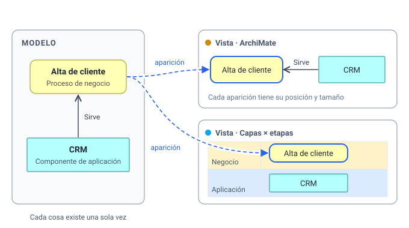
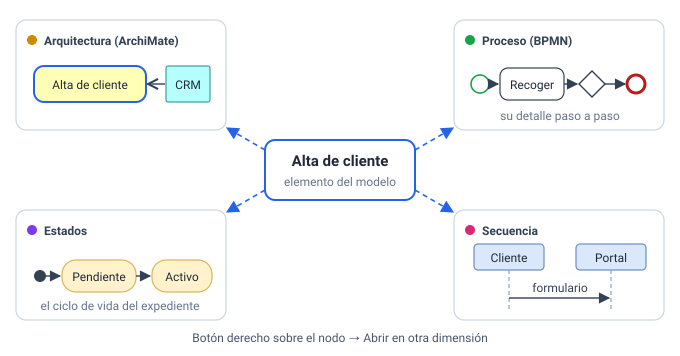
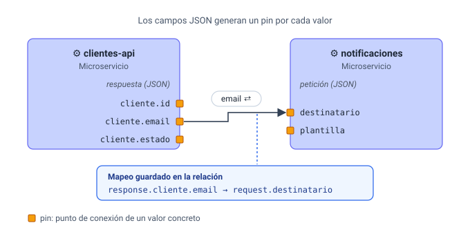
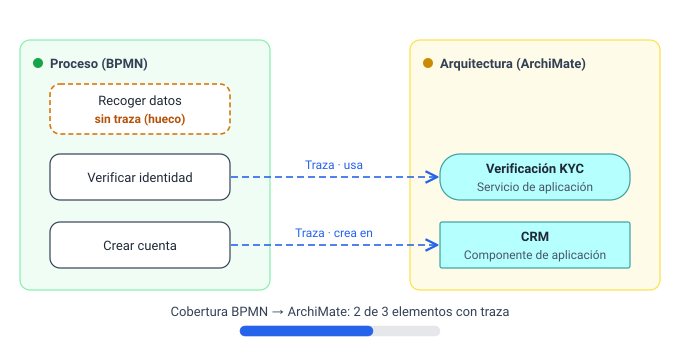
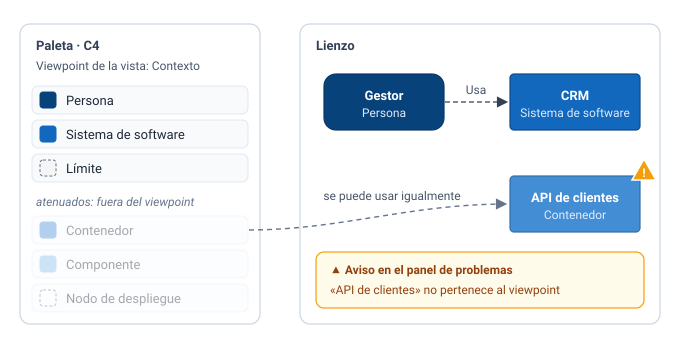

# Conceptos

Este capítulo explica las ideas en las que se apoya all-draw, sin entrar en botones. Si las tienes claras, el
resto de la aplicación se entiende solo. Para el "cómo se hace" paso a paso, ve a
[Modelo y vistas](modelo-y-vistas.md) y [El editor](editor.md).

La idea de fondo cabe en una frase: **dibujas un modelo una vez y lo miras desde muchas notaciones**.

## Modelo y vistas {#modelo-y-vistas}

**Qué es.** En all-draw hay dos niveles:

- El **modelo** guarda *qué existe*: los **elementos** (un proceso, una aplicación, una persona, una tabla…)
  y las **relaciones** entre ellos (la aplicación *sirve* al proceso, el proceso *accede* a los datos…). Cada
  elemento tiene un tipo, un nombre, documentación, campos y etiquetas.
- Las **vistas** guardan *cómo se dibuja*. Una vista es un diagrama: elige algunos elementos del modelo y los
  coloca en el lienzo. Cada dibujo de un elemento en una vista es una **aparición** (un *nodo*); cada dibujo
  de una relación es una **arista**.

**Por qué existe.** Porque en la realidad la misma cosa aparece en muchos diagramas. Si el CRM sale en el
mapa de arquitectura, en el diagrama de contenedores y en la rejilla de capacidades, quieres que sea **el
mismo CRM**: que al renombrarlo cambie en todos lados, y que puedas preguntar "¿dónde aparece el CRM?".

**Consecuencias prácticas.**

| Haces esto… | …y pasa esto |
|---|---|
| Renombras un elemento en una vista | Cambia en todas las vistas donde aparece |
| Editas sus datos en el inspector | Los ves igual desde cualquier vista |
| Mueves o cambias de tamaño un nodo | Solo cambia en esa vista (la posición es de la aparición) |
| Quitas un nodo de una vista (**Supr**) | El elemento sigue en el modelo y en las demás vistas |
| **Borras del modelo** un elemento | Desaparece de todas las vistas, junto con sus relaciones |
| Arrastras un elemento desde la pestaña **Modelo** de la paleta | Aparece una vez más, en esta vista |

Una relación funciona igual: existe una vez en el modelo y puede dibujarse como arista en varias vistas, cada
una con su propio trazado y puntos de quiebre.

> [!NOTE]
> También hay nodos que **no** pertenecen al modelo: las notas, grupos, etiquetas e imágenes de la pestaña
> **Visual** de la paleta. Solo viven en su vista y no se pueden conectar con relaciones.

## Notaciones {#notaciones}

**Qué es.** Una **notación** es un lenguaje de diagramas: ArchiMate, BPMN, máquina de estados, C4, secuencia,
entidad-relación, clases UML, mapa mental, diagrama de flujo, flujo de datos (DFD), capas × etapas y libre.
En all-draw cada notación viene en un **pack** que define:

- los **tipos de elemento** (en BPMN: tarea, evento de inicio, compuerta…), con su forma, color e icono;
- los **tipos de relación** (flujo de secuencia, flujo de mensaje…);
- qué relaciones son válidas entre qué tipos (la [matriz de validez](conceptos.md#validez));
- los [viewpoints](conceptos.md#viewpoints) de la notación;
- qué se puede meter dentro de qué (una lane dentro de una pool, un contenedor dentro de un sistema…).

**Por qué existe.** Cada notación es buena para una pregunta: ArchiMate para la arquitectura de empresa,
BPMN para el paso a paso de un proceso, estados para el ciclo de vida de algo. En vez de elegir una,
all-draw te deja usarlas todas sobre el mismo modelo.

Cada vista tiene **una** notación, que decide su paleta y cómo se pintan los nodos. Aun así puedes mezclar:
la paleta ofrece, plegadas, las demás notaciones como "otra notación". La lista completa y la referencia de
cada pack están en [Notaciones](notaciones.md).

## Dimensiones {#dimensiones}

**Qué es.** Una **dimensión** es un eje por el que puedes mirar *cualquier* elemento: "verlo como proceso
BPMN", "verlo en la arquitectura", "verlo como máquina de estados". Técnicamente es solo un nombre, una
notación y, si quieres, un viewpoint. La demo trae seis: Arquitectura, Proceso (BPMN), Estados, C4,
Capas × etapas y Secuencia.

**Por qué existe.** Para navegar. Con dimensiones definidas, el menú del botón derecho de cualquier nodo
ofrece **Abrir en otra dimensión** con una entrada por dimensión:

- Si el elemento ya tiene una vista de detalle en esa notación, la abre.
- Si no, la entrada pone **(crear)** y crea una vista nueva de esa notación dedicada a ese elemento.

Así, desde el proceso "Alta de cliente" llegas en un clic a su BPMN, a sus estados o a su secuencia, sin
buscar en la lista de vistas.

> [!TIP]
> Sin dimensiones, el menú **Abrir en otra dimensión** sale vacío. Añádelas en el panel **Vistas →
> Dimensiones** (ver [Modelo y vistas](modelo-y-vistas.md#dimensiones)).

## Vistas de detalle y drill-down {#drill-down}

**Qué es.** Una vista puede estar **dedicada a un elemento**: ese elemento es su **elemento raíz**. La vista
BPMN "Alta de cliente · BPMN" tiene como raíz el proceso "Alta de cliente": es *su detalle*. En el panel
Vistas, las vistas con raíz llevan delante un pequeño rombo (◇).

Además, cada aparición (nodo) puede apuntar a una vista concreta como **vista al hacer doble clic**. Hacer
**doble clic** en ese nodo te lleva dentro: eso es el *drill-down* (bajar al detalle).

**Por qué existe.** Para ir de lo general a lo concreto sin perderte. Al entrar en un detalle, la barra
muestra la **ruta de vistas** (por ejemplo *Arquitectura › Alta de cliente · BPMN*) y el botón **←** para
volver. Puedes encadenar niveles: arquitectura → proceso → estados.

Cuando creas una vista con **Abrir en otra dimensión → … (crear)** o **Nueva vista de detalle…**, all-draw
hace las dos cosas a la vez: la nueva vista tiene ese elemento como raíz, y el nodo desde el que la creaste
apunta a ella para el doble clic (si no apuntaba ya a otra).

## Pines {#pines}

**Qué es.** Un **pin** es un valor concreto de un elemento expuesto como **punto de conexión** en el borde de
su caja (un cuadradito naranja). Sirven para decir no solo "este servicio habla con aquel", sino "**este
dato** de este servicio llega a **ese campo** de aquel".

Los pines salen solos de los **campos** del elemento:

- Un campo **JSON** genera un pin por cada valor final. Si la respuesta de un servicio es
  `{"cliente": {"id": "c-1", "email": "ana@acme.com"}}`, aparecen los pines `cliente.id` y `cliente.email`.
- Un campo **lista** genera un pin por entrada, y uno **clave→valor**, un pin por clave.
- Cualquier otro campo puede generar un pin si su definición lo pide. También se pueden declarar pines a mano.

Cuando conectas un pin con otro, la relación guarda además un **mapeo**: qué campo de origen va a qué campo de
destino (`response.cliente.email → request.destinatario`). La arista lo muestra con una etiqueta como
`email ⇄`, y el inspector de la relación lista los mapeos.

**Por qué existe.** Para documentar integraciones de forma precisa: qué datos viajan entre sistemas y de qué
campo a qué campo. En la demo, el microservicio `clientes-api` envía `cliente.email` al campo `destinatario`
de `notificaciones`.

En cada nodo eliges qué pines se ven (pestaña **Pines** del inspector): un servicio con una respuesta grande
puede tener decenas, y normalmente solo te interesan unos pocos. Los pines que ya usa una relación llevan
un ● y no se pueden ocultar. Al conectar dos pines, solo se ofrecen las relaciones compatibles con ellos.

## Trazas y relaciones puente {#trazas}

**Qué es.** A veces el mismo concepto está modelado **dos veces, en dos notaciones**: la tarea BPMN
"Verificar identidad" y el servicio ArchiMate "Verificación KYC" hablan de lo mismo desde niveles distintos.
Las **relaciones puente** dejan constancia de esa correspondencia. Son relaciones del núcleo, válidas entre
cualquier notación:

| Relación | Línea | Significado |
|---|---|---|
| **Traza** | discontinua, punta abierta | "Es lo mismo que" / "corresponde a" (la más general) |
| **Realiza** | discontinua, punta triangular | "Lo implementa": una tarea BPMN realiza un proceso ArchiMate; un contenedor C4 realiza un componente de aplicación |
| **Refina** | punteada, punta abierta | "Lo detalla": un estado refina un objeto de negocio |

**Por qué existe.** Para la **trazabilidad**: poder responder "¿qué tareas del proceso usan este servicio?"
o "¿qué elementos del BPMN no están conectados con la arquitectura?". Lo segundo es la **cobertura**: el
porcentaje de elementos de una notación que tienen alguna traza hacia otra. Los que no tienen ninguna son
**huecos**.

all-draw te ayuda a crear trazas **sugiriendo** parejas: elementos de otra notación con el mismo nombre,
que aparecen en la vista de detalle del otro, que comparten palabras o cuyos tipos suelen corresponderse.
Las sugerencias aparecen en:

- el menú del botón derecho del nodo, sección **Trazas** ("Enlazar con …");
- la pestaña **Dónde** del inspector, secciones **Trazas** y **Sugerencias**;
- el panel **Espacio → Trazabilidad**: una matriz entre dos notaciones, la cobertura, los huecos y un botón
  para enlazar varias sugerencias de golpe (ver [Librerías, reglas y personas](librerias-reglas-personas.md)).

El panel de problemas también avisa (como nota) de cada elemento sin traza, con un botón para crear la mejor
sugerencia.

> [!NOTE]
> La cobertura solo tiene sentido si el espacio mezcla al menos dos notaciones. Con una sola, no hay huecos
> que mostrar.

## Viewpoints {#viewpoints}

**Qué es.** Un **viewpoint** es un recorte de una notación pensado para una audiencia o pregunta. C4 tiene
uno por nivel (*Contexto*, *Contenedor*, *Componente*, *Código*, *Despliegue*); ArchiMate trae 25 (*Layered*,
*Business Process Cooperation*…); BPMN tiene *Proceso* y *Coreografía*.

Cada vista puede tener un viewpoint (se elige en el inspector de la vista). Cuando lo tiene, la paleta
**atenúa** los tipos que no le corresponden y los pone al final.

**Por qué existe.** Para guiarte sin encerrarte. En una vista de *Contexto* C4 lo normal es dibujar personas
y sistemas, no contenedores; el viewpoint te lo recuerda, pero **no te lo prohíbe**. Si usas un tipo
atenuado, el panel de problemas muestra un **aviso** ("… no pertenece al viewpoint de la vista") con la opción
de quitarlo de la vista. Tú decides.

Algunos viewpoints (como *Layered* en ArchiMate) admiten todos los tipos, así que no atenúan nada.

## Matriz de validez {#validez}

**Qué es.** Cada notación con reglas formales trae una **matriz de validez**: para cada pareja de tipos
(origen, destino), qué relaciones están permitidas. En ArchiMate, por ejemplo, un componente de aplicación
puede *servir* a un proceso de negocio, pero no *componerlo*. La matriz de ArchiMate sale directamente de la
especificación (la misma que usa Archi).

**Por qué existe.** Para que el modelo sea correcto sin que tengas que saberte la especificación de memoria.

**Cómo se nota al dibujar.** Al soltar una conexión entre dos nodos aparece el menú **Tipo de relación**
con las opciones posibles:

- Entre dos elementos de la **misma notación**: las relaciones que la matriz permite para esos dos tipos
  (la habitual de la notación sale la primera), más las relaciones generales del núcleo (**Enlace**,
  **Traza**, **Realiza**, **Refina**, **Flujo de datos**), que siempre están disponibles.
- Entre elementos de **notaciones distintas**: solo las relaciones del núcleo.
- Entre dos **pines**: solo las relaciones compatibles con esos pines.
- Con una nota, grupo, etiqueta o imagen: la conexión se **rechaza**, porque no son elementos del modelo.

La notación **Libre** no tiene matriz: admite cualquier relación entre cualquier par.

**Relaciones que se vuelven inválidas.** Si importas un modelo de otra herramienta o cambias tipos, puede
quedar alguna relación que la matriz no permite. El panel de problemas la marca como **error** ("… no es
válida entre … y …") y ofrece arreglos: cambiarla por una relación válida o borrarla.

## Espacios {#espacios}

**Qué es.** Un **espacio** (*workspace*) es un proyecto completo: el modelo, todas sus vistas, las dimensiones,
las librerías de tipos, las reglas de estilo, las personas y los comentarios. Todo lo que hay en all-draw
vive dentro de un espacio, y los elementos de un espacio no se ven desde otro.

Hay dos clases:

- **Local**: vive solo en tu navegador. No necesita cuenta y funciona siempre sin conexión, pero no se
  comparte ni se copia a otro ordenador.
- **En el servidor**: vive en el servidor y tiene copia en tu navegador. Se puede compartir con enlaces de
  edición o de lectura, varias personas pueden editarlo a la vez, guarda historial y funciona sin conexión
  (sincroniza al volver).

Un espacio local se puede **subir al servidor** en cualquier momento (se crea una copia). Los detalles
prácticos están en [Primeros pasos](primeros-pasos.md#espacios-locales-y-servidor) y en
[Compartir y colaborar](compartir-y-colaborar.md).

## Resumen {#resumen}

| Concepto | En una frase | Dónde lo ves |
|---|---|---|
| Elemento | Una cosa que existe en el modelo, una sola vez | Inspector (pestaña **Datos**), paleta → **Modelo** |
| Relación | Un vínculo con tipo entre dos elementos | Inspector de una arista |
| Vista | Un diagrama en una notación | Panel **Vistas** |
| Aparición (nodo) | Un elemento dibujado en una vista | El lienzo; inspector → **Dónde** |
| Notación | Un lenguaje de diagramas (pack de tipos y reglas) | Paleta → **Notación**; [Notaciones](notaciones.md) |
| Dimensión | Un eje para ver cualquier elemento en una notación | Panel **Vistas → Dimensiones**; botón derecho → **Abrir en otra dimensión** |
| Elemento raíz / vista de detalle | La vista dedicada a un elemento | Inspector de la vista; ◇ en el panel Vistas; doble clic en el nodo |
| Pin | Un valor de un elemento usable como punto de conexión | Inspector → **Pines**; cuadraditos en el borde del nodo |
| Mapeo | Qué campo va a qué campo en una relación entre pines | Inspector de la relación; etiqueta `⇄` en la arista |
| Traza | Une el mismo concepto en dos notaciones | Inspector → **Dónde**; **Espacio → Trazabilidad** |
| Viewpoint | Un recorte de una notación; atenúa, no prohíbe | Inspector de la vista; paleta atenuada |
| Matriz de validez | Qué relaciones permite la notación entre dos tipos | Menú **Tipo de relación**; panel de problemas |
| Espacio | El proyecto completo, local o en el servidor | Pantalla de inicio |

## Confusiones habituales {#confusiones-habituales}

**"He borrado una caja y el elemento sigue saliendo en la paleta."**
**Supr** quita la aparición de *esta* vista, no el elemento. Para borrarlo de todo: botón derecho → **Borrar
del modelo**. Ver [Modelo y vistas](modelo-y-vistas.md#quitar-o-borrar).

**"He copiado y pegado una caja, la renombro y cambian las dos."**
**Ctrl+V** pega una *nueva aparición del mismo elemento*. Si querías un elemento distinto, usa
**Ctrl+Shift+V** (pegar como copia) o **Ctrl+D** (duplicar).

**"Abrir en otra dimensión no muestra nada."**
El espacio no tiene dimensiones. Añádelas en **Vistas → Dimensiones**.

**"La relación que quiero no aparece en el menú."**
La matriz de la notación no la permite entre esos dos tipos. Comprueba que los tipos son los que crees, o
usa una relación del núcleo (**Enlace**, **Traza**…) si solo quieres dejar constancia del vínculo.

**"He puesto un tipo atenuado y me sale un aviso."**
Es el viewpoint de la vista. Puedes ignorar el aviso, quitar el nodo o cambiar el viewpoint de la vista a
*(ninguno: todo)*.
