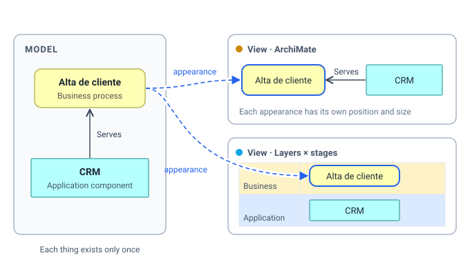
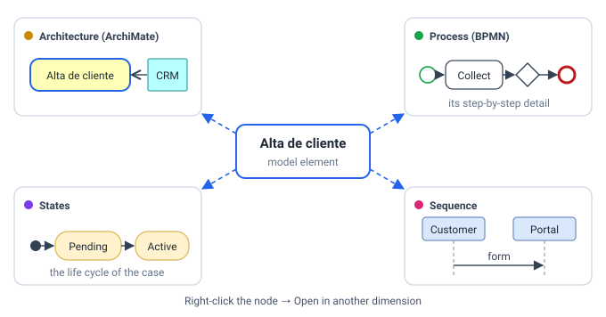
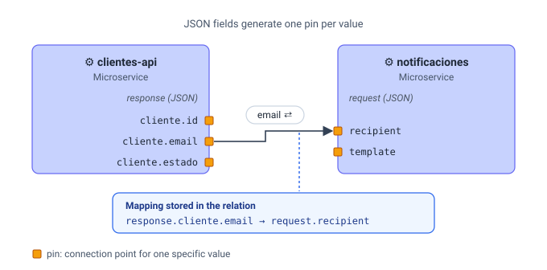
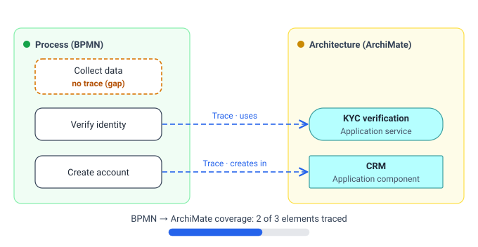
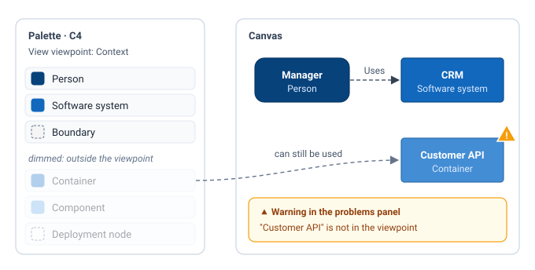

# Concepts

This chapter explains the ideas all-draw is built on, without going into buttons. Once they are clear, the
rest of the app makes sense on its own. For step-by-step "how to", go to
[Model and views](modelo-y-vistas.md) and [The editor](editor.md).

The core idea fits in one sentence: **you draw a model once and look at it through many notations**.

## Model and views {#modelo-y-vistas}

**What it is.** all-draw has two levels:

- The **model** stores *what exists*: the **elements** (a process, an application, a person, a table…) and
  the **relations** between them (the application *serves* the process, the process *accesses* the data…).
  Each element has a type, a name, documentation, fields and tags.
- The **views** store *how it is drawn*. A view is a diagram: it picks some elements from the model and places
  them on the canvas. Each drawing of an element in a view is an **appearance** (a *node*); each drawing of a
  relation is an **edge**.

**Why it exists.** Because in real life the same thing appears in many diagrams. If the CRM shows up in the
architecture map, in the container diagram and in the capability grid, you want it to be **the same CRM**: so
that renaming it changes it everywhere, and so you can ask "where does the CRM appear?".

**What it means in practice.**

| You do this… | …and this happens |
|---|---|
| Rename an element in one view | It changes in every view where it appears |
| Edit its data in the inspector | You see the same data from any view |
| Move or resize a node | Only that view changes (position belongs to the appearance) |
| Remove a node from a view (**Del**) | The element stays in the model and in the other views |
| **Delete from model** an element | It disappears from every view, together with its relations |
| Drag an element from the palette's **Model** tab | It appears once more, in this view |

A relation works the same way: it exists once in the model and can be drawn as an edge in several views, each
with its own routing and bend points.

> [!NOTE]
> There are also nodes that do **not** belong to the model: the notes, groups, labels and images from the
> palette's **Visual** tab. They only live in their view and cannot be connected with relations.

## Notations {#notaciones}

**What it is.** A **notation** is a diagram language: ArchiMate, BPMN, state machine, C4, sequence,
entity-relationship, UML classes, mind map, flowchart, data flow (DFD), layers × stages and freeform. In
all-draw each notation comes as a **pack** that defines:

- the **element types** (in BPMN: task, start event, gateway…), with their shape, colour and icon;
- the **relationship types** (sequence flow, message flow…);
- which relations are valid between which types (the [validity matrix](conceptos.md#validez));
- the notation's [viewpoints](conceptos.md#viewpoints);
- what can go inside what (a lane inside a pool, a container inside a system…).

**Why it exists.** Each notation is good at one question: ArchiMate for enterprise architecture, BPMN for
the step-by-step of a process, states for the life cycle of something. Instead of picking one, all-draw lets
you use them all on the same model.

Each view has **one** notation, which decides its palette and how nodes are drawn. You can still mix: the
palette offers the other notations, collapsed, as "other notation". The full list and each pack's reference
are in [Notations](notaciones.md).

## Dimensions {#dimensiones}

**What it is.** A **dimension** is an axis along which you can look at *any* element: "see it as a BPMN
process", "see it in the architecture", "see it as a state machine". Technically it is just a name, a
notation and, optionally, a viewpoint. The demo comes with six: Arquitectura (architecture), Proceso (BPMN),
Estados (states), C4, Capas × etapas (layers × stages) and Secuencia (sequence).

**Why it exists.** For navigation. With dimensions defined, the right-click menu of any node offers
**Open in another dimension** with one entry per dimension:

- If the element already has a detail view in that notation, it opens it.
- If not, the entry says **(create)** and creates a new view in that notation dedicated to that element.

So from the "Alta de cliente" process you reach its BPMN, its states or its sequence in one click, without
hunting through the list of views.

> [!TIP]
> Without dimensions, the **Open in another dimension** menu is empty. Add them in the **Views → Dimensions**
> panel (see [Model and views](modelo-y-vistas.md#dimensiones)).

## Detail views and drill-down {#drill-down}

**What it is.** A view can be **dedicated to an element**: that element is its **root element**. The BPMN
view "Alta de cliente · BPMN" has the "Alta de cliente" process as its root: it is *its detail*. In the Views
panel, views with a root have a small diamond (◇) in front.

On top of that, each appearance (node) can point to a specific view as its **view on double-click**.
**Double-clicking** that node takes you inside: that is the *drill-down*.

**Why it exists.** To go from the general to the specific without getting lost. When you enter a detail, the
toolbar shows the **view path** (for example *Arquitectura › Alta de cliente · BPMN*) and the **back** button
(←) to return. You can chain levels: architecture → process → states.

When you create a view with **Open in another dimension → … (create)** or **New detail view…**, all-draw does
both things at once: the new view gets that element as its root, and the node you created it from points to it
for double-click (unless it already pointed to another one).

## Pins {#pines}

**What it is.** A **pin** is a specific value of an element exposed as a **connection point** on the edge of
its box (a small orange square). Pins let you say not just "this service talks to that one", but "**this
piece of data** from this service goes to **that field** of that one".

Pins come automatically from the element's **fields**:

- A **JSON** field generates one pin per leaf value. If a service's response is
  `{"cliente": {"id": "c-1", "email": "ana@acme.com"}}`, you get the pins `cliente.id` and `cliente.email`.
- A **list** field generates one pin per entry, and a **key→value** field one pin per key.
- Any other field can generate a pin if its definition asks for it. Pins can also be declared by hand.

When you connect one pin to another, the relation also stores a **mapping**: which source field goes to which
target field (`response.cliente.email → request.destinatario`). The edge shows it with a label such as
`email ⇄`, and the relation's inspector lists the mappings.

**Why it exists.** To document integrations precisely: what data travels between systems and from which
field to which field. In the demo, the `clientes-api` microservice sends `cliente.email` to the `destinatario`
(recipient) field of `notificaciones` (notifications).

On each node you choose which pins are shown (inspector, **Pins** tab): a service with a big response may
have dozens, and usually you only care about a few. Pins already used by a relation are marked with ● and
cannot be hidden. When you connect two pins, only the relations compatible with them are offered.

## Traces and bridge relations {#trazas}

**What it is.** Sometimes the same concept is modelled **twice, in two notations**: the BPMN task "Verificar
identidad" (verify identity) and the ArchiMate service "Verificación KYC" (KYC verification) talk about the
same thing from different levels. **Bridge relations** record that correspondence. They are core relations,
valid between any notations:

| Relation | Line | Meaning |
|---|---|---|
| **Trace** | dashed, open arrowhead | "Is the same as" / "corresponds to" (the most general one) |
| **Realizes** | dashed, triangle arrowhead | "Implements it": a BPMN task realizes an ArchiMate process; a C4 container realizes an application component |
| **Refines** | dotted, open arrowhead | "Details it": a state refines a business object |

**Why it exists.** For **traceability**: being able to answer "which process tasks use this service?" or
"which BPMN elements are not connected to the architecture?". The latter is **coverage**: the share of a
notation's elements that have at least one trace to another notation. Those without any are **gaps**.

all-draw helps you create traces by **suggesting** pairs: elements in another notation with the same name,
that appear in the other's detail view, that share words, or whose types usually correspond. Suggestions
appear in:

- the node's right-click menu, **Traces** section ("Link to …");
- the inspector's **Where** tab, **Traces** and **Suggestions** sections;
- the **Workspace → Traceability** panel: a matrix between two notations, coverage, gaps and a button to link
  several suggestions at once (see [Libraries, rules and people](librerias-reglas-personas.md)).

The problems panel also adds a note for each element without a trace, with a button to create the best
suggestion.

> [!NOTE]
> Coverage only makes sense if the workspace mixes at least two notations. With just one, there are no gaps
> to show.

## Viewpoints {#viewpoints}

**What it is.** A **viewpoint** is a subset of a notation aimed at an audience or a question. C4 has one per
level (*Context*, *Container*, *Component*, *Code*, *Deployment*); ArchiMate ships 25 (*Layered*,
*Business Process Cooperation*…); BPMN has *Process* and *Choreography*.

Each view can have a viewpoint (chosen in the view's inspector). When it does, the palette **dims** the types
that do not belong to it and moves them to the end.

**Why it exists.** To guide you without locking you in. In a C4 *Context* view you normally draw people and
systems, not containers; the viewpoint reminds you, but it **does not forbid it**. If you use a dimmed type,
the problems panel shows a **warning** (the element does not belong to the view's viewpoint) with the option
to remove it from the view. Your call.

Some viewpoints (like ArchiMate's *Layered*) accept every type, so they dim nothing.

## Validity matrix {#validez}

**What it is.** Each notation with formal rules ships a **validity matrix**: for each pair of types (source,
target), which relations are allowed. In ArchiMate, for example, an application component can *serve* a
business process, but cannot *compose* it. The ArchiMate matrix comes straight from the specification (the same
one Archi uses).

**Why it exists.** So the model is correct without you having to know the specification by heart.

**How you notice it while drawing.** When you drop a connection between two nodes, the **Relationship type**
menu appears with the possible options:

- Between two elements of the **same notation**: the relations the matrix allows for those two types (the
  notation's usual one is listed first), plus the general core relations (**Link**, **Trace**, **Realizes**,
  **Refines**, **Data flow**), which are always available.
- Between elements of **different notations**: only the core relations.
- Between two **pins**: only the relations compatible with those pins.
- With a note, group, label or image: the connection is **refused**, because they are not model elements.

The **Freeform** notation has no matrix: it accepts any relation between any pair.

**Relations that become invalid.** If you import a model from another tool or change types, a relation the
matrix does not allow may be left behind. The problems panel flags it as an **error** (the relationship is not
valid between those two types) and offers fixes: change it to a valid relation or delete it.

## Workspaces {#espacios}

**What it is.** A **workspace** is a complete project: the model, all its views, the dimensions, the type
libraries, the style rules, the people and the comments. Everything in all-draw lives inside a workspace, and
one workspace's elements are not visible from another.

There are two kinds:

- **Local**: lives only in your browser. It needs no account and always works offline, but it cannot be
  shared or copied to another computer.
- **On the server**: lives on the server with a copy in your browser. It can be shared with edit or
  read-only links, several people can edit it at the same time, it keeps history and it works offline (it
  syncs when the connection is back).

A local workspace can be **uploaded to the server** at any time (a copy is created). The practical details are
in [Getting started](primeros-pasos.md#espacios-locales-y-servidor) and in
[Sharing and collaborating](compartir-y-colaborar.md).

## Summary {#resumen}

| Concept | In one sentence | Where you see it |
|---|---|---|
| Element | A thing that exists in the model, only once | Inspector (**Data** tab), palette → **Model** |
| Relation | A typed link between two elements | Inspector of an edge |
| View | A diagram in one notation | **Views** panel |
| Appearance (node) | An element drawn in a view | The canvas; inspector → **Where** |
| Notation | A diagram language (pack of types and rules) | Palette → **Notation**; [Notations](notaciones.md) |
| Dimension | An axis to see any element in a notation | **Views → Dimensions** panel; right-click → **Open in another dimension** |
| Root element / detail view | The view dedicated to an element | View inspector; ◇ in the Views panel; double-click the node |
| Pin | An element's value usable as a connection point | Inspector → **Pins**; small squares on the node's edge |
| Mapping | Which field goes to which field in a pin-to-pin relation | Relation inspector; `⇄` label on the edge |
| Trace | Links the same concept in two notations | Inspector → **Where**; **Workspace → Traceability** |
| Viewpoint | A subset of a notation; dims, does not forbid | View inspector; dimmed palette |
| Validity matrix | Which relations the notation allows between two types | **Relationship type** menu; problems panel |
| Workspace | The whole project, local or on the server | Home screen |

## Common confusions {#confusiones-habituales}

**"I deleted a box and the element still shows up in the palette."**
**Del** removes the appearance from *this* view, not the element. To delete it everywhere: right-click →
**Delete from model**. See [Model and views](modelo-y-vistas.md#quitar-o-borrar).

**"I copied and pasted a box, renamed it, and both changed."**
**Ctrl+V** pastes a *new appearance of the same element*. If you wanted a different element, use
**Ctrl+Shift+V** (paste as copy) or **Ctrl+D** (duplicate).

**"Open in another dimension shows nothing."**
The workspace has no dimensions. Add them in **Views → Dimensions**.

**"The relation I want is not in the menu."**
The notation's matrix does not allow it between those two types. Check the types are what you think, or use a
core relation (**Link**, **Trace**…) if you just want to record the connection.

**"I used a dimmed type and got a warning."**
That is the view's viewpoint. You can ignore the warning, remove the node, or set the view's viewpoint to
*(none: everything)*.
