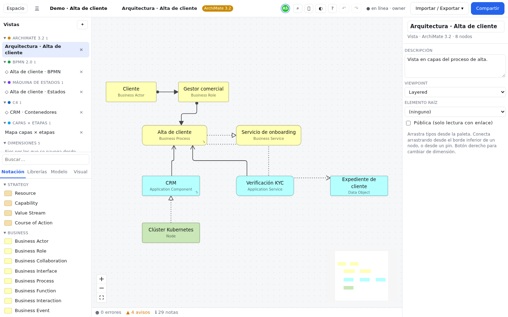
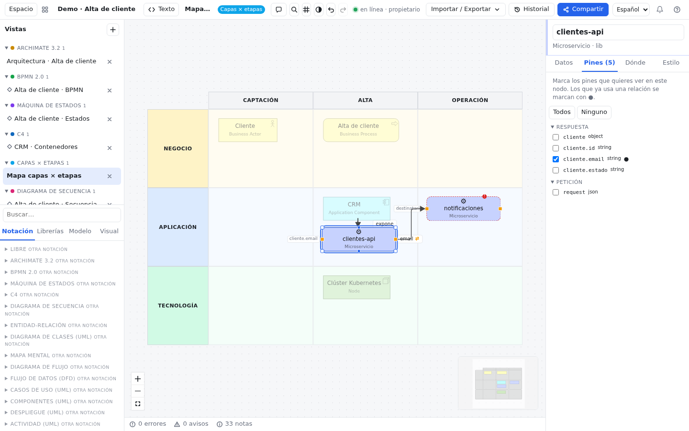
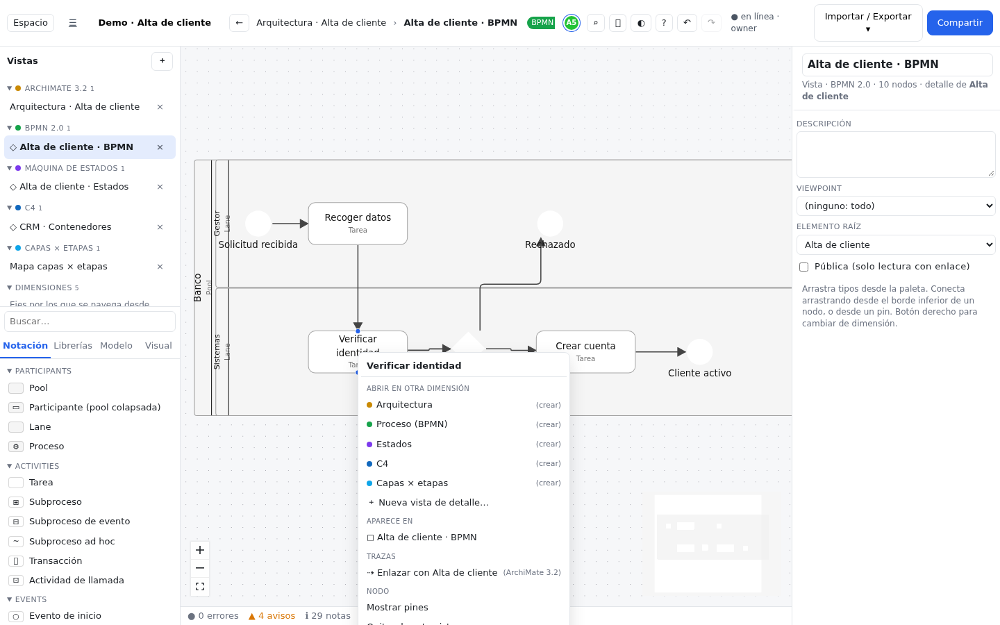
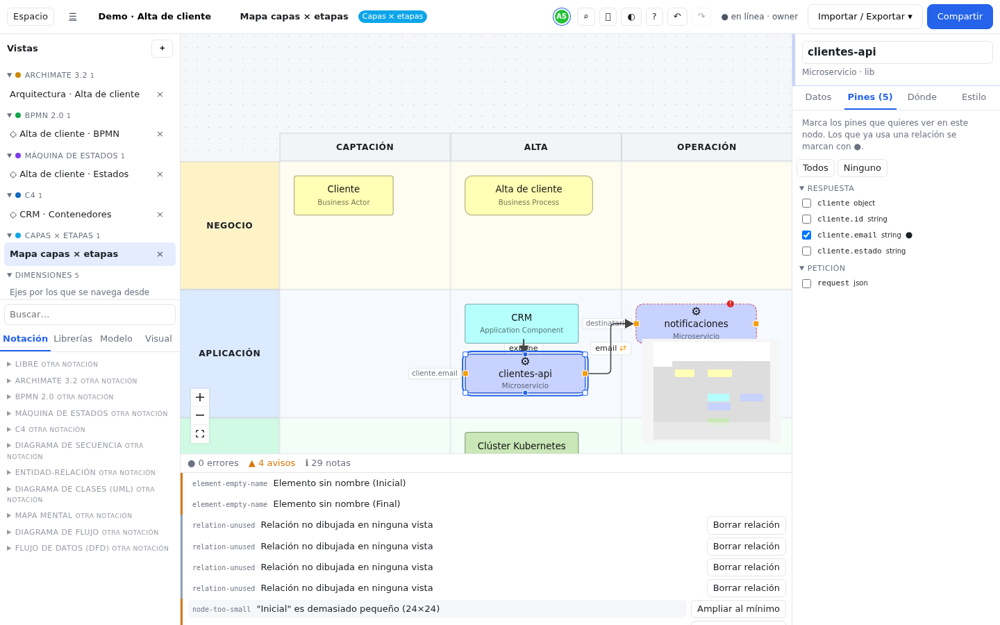

# The editor

The editor is where you draw: you add elements, connect them, arrange them and fill in their data. This chapter
walks through every part of the screen and the everyday tasks. If you are not yet sure what an *element*, a *view* or
a *notation* is, take a look at [Concepts](conceptos.md) first.

## The areas of the screen {#zonas}

The layout adapts to the width of the window. What changes is *where* things are, not what you can do.

### On a computer {#escritorio}

With a wide window (1100 px or more) you see everything at once:

1. **Top bar**, from left to right:
   - **Workspace**: opens the panel with libraries, rules, people and traceability (see
     [Libraries, rules and people](librerias-reglas-personas.md)).
   - **☰**: back to the list of all your workspaces.
   - **Workspace name**: click and type to change it.
   - **View path**: the views you have drilled into (for example `Map › Customer onboarding`). Click any of them to go
     back to it, or press the **Back** arrow. On the right, a colored tag shows the notation of the current view.
   - **Connected people** (server workspaces only), **Comments**, **Search**, **Snap to grid**, **Theme** and
     **Keyboard shortcuts**. If you are not sure what a button does, hover over it: its name appears.
   - **Undo** and **Redo**.
   - **Save status**: `saved in this browser` for a local workspace; `● online`, `◌ connecting…` or
     `○ offline (syncs when back)` for a server workspace, followed by your role.
   - **Import / Export**, **History** (server workspaces), **Share** (if you are the owner) or **Upload to server** (if
     the workspace is local), and the language selector.
2. **Left column**: the **Views** panel at the top (grouped by notation, with the **Dimensions** and a summary of the
   **Model**) and the **Palette** below.
3. **Canvas** in the center, with zoom controls and the minimap in the corners. Below it, the **problems** bar.
4. **Inspector** on the right: shows whatever you have selected (an element, an edge or, if nothing is selected, the
   view).

### On a tablet {#tableta}

Between 700 and 1099 px wide, both side columns can be hidden to give the canvas more room:

- The button at the far left of the bar (**Show or hide views and palette**) folds the left column.
- The one at the far right (**Show or hide the inspector**) folds the inspector.

The app remembers in this browser which panels you left open.

### On a phone {#movil}

Below 700 px the canvas fills the whole screen. The top bar shrinks to the name, undo/redo and **More options**, and
a **bottom bar** with four buttons appears. Each one opens a **sheet** that slides up from the bottom:

| Button | What it contains |
|---|---|
| **Views** | The list of views and dimensions. |
| **Add** | The palette. **Tap** an item to add it in a free spot near the center of the canvas (there is no dragging on a phone). |
| **Inspector** | The data of the selection. |
| **More** | The view path, **Workspace**, search, grid, theme, shortcuts, **Fit to view**, **Auto layout** and the app actions (import/export, share, language…). |

To close a sheet, tap outside it, press the close button or drag it down by its handle. On touch screens, **press and
hold** a node for half a second to open its menu (the equivalent of right-clicking), which slides up from the bottom as a
sheet.

## The palette {#paleta}

The palette is the drawer you take things from. It has a **Search…** field that filters the open tab, and four tabs:

| Tab | What it holds | When to use it |
|---|---|---|
| **Notation** | The types of the current view's notation, grouped by category. If the view has a *viewpoint*, the types that do not fit are dimmed at the end. Below, folded, the other notations ("other notation"). | Almost always: this is the normal way to draw. |
| **Libraries** | The types you created in your libraries and the **components** (reusable templates). | When you work with your own types or ones imported from Drawer or OpenAPI. |
| **Model** | Elements that **already exist** in the workspace. Those that appear in no view are marked as orphans. | To draw in this view something that is already in another one. |
| **Visual** | **Note**, **Group** (a frame that drags what it contains), **Label** (text with no border) and **Images** (by URL or from a file, which is stored inside the workspace). | To annotate and decorate: these nodes are not part of the model and only exist in this view. |

> [!TIP]
> Dragging from **Model** does not create a new element: it creates another *occurrence* of the same one. If you then
> rename it, the name changes in every view. This is the right way to reuse; see [Model and views](modelo-y-vistas.md).

## Adding nodes {#anadir}

1. In the palette, find the type you want (for example *Business Process* in ArchiMate or *Task* in BPMN).
2. **Drag** it onto the canvas and drop it where you like. A **click** (or **Enter** from the keyboard) adds it in a
   free spot near the center of the canvas. On a phone, open **Add** and tap it.
3. The node starts with the type's name. Press **F2** (or double-click the name) and type the real name. **Enter**
   confirms, **Esc** cancels.
4. Fill in the rest of the data in the **Inspector** (documentation, fields, tags).

If you drop it on top of a container (a pool, a group, a C4 system…), it goes inside; see [Nesting](#anidar).

## Connecting elements {#conectar}

1. Hover over the source node: small dots appear on its border.
2. Drag from the **dot on the bottom edge** to the other node and release over it (while you drag, the connection dots
   of every node light up).
3. What happens depends on the notation:
   - if there is only **one** possible relationship between those two types, it is created straight away;
   - if there are **several**, the **Relationship type** menu appears so you can choose (the notation's default
     relationship comes first);
   - if **none** is allowed, the line does not snap and nothing is created.

### Why a connection is refused {#conexion-rechazada}

Each notation has a **validity matrix**: a table that says which relationships are allowed between each pair of types.
For example, in BPMN a sequence flow cannot leave a pool. If the connection does not "snap", that relationship is not
allowed. Read [Validity](conceptos.md#validez) to understand the idea, and try one of these:

- connect in the other direction (many relationships are only valid one way);
- choose another element type that better fits what you want to say;
- if you are mixing notations on purpose, use a bridge relationship (trace, realizes, refines): see
  [Traces](conceptos.md#trazas).

Relationships that already existed and have stopped being valid (for example after changing a type) do not
disappear: they show up as errors in the [problems panel](#problemas), with a button to fix them.

### Editing an edge {#aristas}

Select the edge (click the line) and, in the inspector, you can change:

- the **relationship type**, the name and the documentation;
- the relationship's own fields (the condition of a BPMN sequence flow, the event and guard of a state transition…);
- the **Routing**: *Straight*, *Curved* or *Orthogonal*, and the **Line** style (*Solid*, *Dashed*, *Dotted*).

**Double-click** the line to add a **bend point**: drag it to shape the edge and double-click it to remove it. When
an edge with bend points is selected, the **Remove bend points** button appears and removes them all at once.

## Pins {#pines}

**Pins** are specific pieces of an element's data turned into connection points. For example, an API can have one pin
per field of its response (`response.customer.email`). They let you say *which data* travels from one place to
another, not just that two things are related. The full idea is in [Pins](conceptos.md#pines).

To use them:

1. Select the node and open the **Pins** tab of the inspector.
2. Tick the pins you want to show on *this* node, or press **All** / **None**. Those already used by a relationship
   are marked **●** and cannot be hidden. You can also use **Show pins** / **Hide pins** in the right-click menu.
3. Pins appear as small orange squares: **input** pins on the left and **output** pins on the right.
4. Drag from an output pin to an input pin of another node. Only relationships compatible with those data types are
   offered.

A relationship between pins also stores the **mapping** (which field goes to which field) and shows it as a label on
the edge. In the demo, the `clientes-api` microservice connects `cliente.email` with `notificaciones`.

Pins come from the type's fields: *JSON*, *List* and *Key → value* fields generate pins on their own, and any other
field can be set to **generates pins** in the library; see [Pins on fields](librerias-reglas-personas.md#pines-en-campos).
If an element has no pins, the tab says so.

## Nesting {#anidar}

Nesting means putting one node inside another: a task inside a lane, a container inside a C4 system, a state inside a
composite state.

1. Drag the child node and drop it **inside** the parent. This only works if the parent is a **container** in its
   notation (pool, lane and subprocess in BPMN; system and container in C4; composite state; group in ArchiMate;
   package in UML…).
2. From then on, the child moves with the parent.
3. If the notation defines an implicit relationship for nesting, it is created automatically. In ArchiMate, for
   example, putting an application inside another one creates a *Composition*.
4. To take it out, drag it outside the parent.

Want to group things visually without creating relationships? Use a **Group** from the **Visual** tab.

## Moving, resizing and aligning {#mover}

- **Move**: drag the node. With the keyboard, the **arrow keys** move it 1 px and **Shift + arrows** 10 px.
- **Pan the canvas**: drag on an empty area. **Zoom**: mouse wheel, pinch on touch screens, the **+** / **−** keys, or
  the buttons in the corner. **Ctrl+0** goes back to 100 % and **Ctrl+Shift+F** fits the whole view.
- **Resize**: select the node and drag its corners. You can also type the width and height in the **Style** tab of the
  inspector.
- **Snap to grid** (button in the bar): nodes move in 8 px steps. Hold **Alt** while dragging to turn it off for a
  moment.
- **Select several**: **Shift + click** each one, or **Shift + drag** on an empty area to draw a selection rectangle.
  **Ctrl+A** selects everything.

With **two or more** nodes selected, a floating alignment bar appears:

| Group | Buttons |
|---|---|
| Horizontal | Align left, Center horizontally, Align right |
| Vertical | Align top, Center vertically, Align bottom |
| Distribute (3 or more) | Distribute horizontally, Distribute vertically |
| Size | Match width, Match height |

**Auto layout** (right-click on the canvas, the **More** sheet on a phone, or Ctrl+K → "Auto layout of the view")
rearranges every node according to the notation: in layers for BPMN and flowcharts, as a tree for mind maps, cell by
cell in the grid. If you do not like the result, **Ctrl+Z** undoes it in one go.

## Copy, paste and duplicate {#copiar}

| Shortcut | What it does |
|---|---|
| **Ctrl+C** then **Ctrl+V** | Pastes **new occurrences of the same elements**. This is the trick for taking something to another view: copy, switch views and paste. |
| **Ctrl+Shift+V** | Pastes as a **copy**: creates new elements, independent of the original. |
| **Ctrl+D** | Duplicates the selection (new elements) in the same view. |

Right-clicking on the canvas, **Paste here** drops what you copied under the pointer. In a grid, pasted nodes go to
the cell under the pointer. If you paste something copied from *another* workspace (for example in another tab), it is
always pasted as a copy, because those elements do not exist in this workspace.

## Removing or deleting {#borrar}

There is an important difference between **removing from the view** and **deleting from the model**:

| Action | How | Result |
|---|---|---|
| Remove a node from the view | **Delete** (or Backspace) with the node selected, or **Remove from this view** in its menu | The node disappears from this view, but the element stays in the model and in other views. |
| Delete an element from the model | **Delete from model** in the right-click menu (asks for confirmation) | The element disappears from **every** view, along with its relationships. |
| Remove an edge from the view | **Delete** with the edge selected, or **Remove from this view** in its menu or the inspector | The edge disappears from this view; the **relationship** stays in the model and in other views. |
| Delete a relationship from the model | **Shift+Delete** with the edge selected, or **Delete from model** in its menu or the inspector (asks for confirmation) | The **relationship** is deleted from the model, and with it all its edges in every view. |

If you make a mistake, **Ctrl+Z** brings it back.

## The inspector {#inspector}

The inspector changes depending on what you select.

**An element** has four tabs:

| Tab | Contents |
|---|---|
| **Data** | Name, documentation, the fields of its type, free properties, **Tags** (comma-separated), the list of **Relations**, the assigned **People** and its comments. |
| **Pins** | Which pins are shown on this node; see [Pins](#pines). |
| **Where** | The element's **Detail views**, the views it **Appears in**, which view opens on double-click, and its **Traces** and trace **Suggestions** with other notations. |
| **Style** | Fill, border, text color, size, alternate text and figure. It only affects **this occurrence**: to style by data in every view, use [rules](librerias-reglas-personas.md#reglas). |

**An edge** shows the relationship type, its fields, the routing and the line (see [Editing an edge](#aristas)).

**Nothing selected** shows the **view**: name, description, *viewpoint* (which limits which types fit), root element
and, in a grid, its layers and stages.

## Right-click menus {#menus}

**On a node** (or press and hold on touch screens):

- **Enter detail**, if the node has a detail view (also by double-clicking the node).
- **Open in another dimension**: jumps to that element's view in another notation, or creates it if it does not exist.
  See [Dimensions](conceptos.md#dimensiones).
- **New detail view…**, in any notation.
- **Appears in**: the views where it is already drawn.
- **Traces**: up to three trace suggestions with similar elements of other notations (**Link to…**).
- **Comment**, **Show pins** / **Hide pins**, **Remove from this view** and **Delete from model**.

**On an edge**: **Comment**, **Remove from this view** (**Delete**) and **Delete from model** (**Shift+Delete**, asks
for confirmation). The same two buttons are at the bottom of the edge inspector.

**On the empty canvas**: **Paste here**, **Add note**, **Comment here**, **Select all**, **Fit to view** and **Auto
layout**.

## Layers × stages grid {#rejilla}

In a *Layers × stages* view the canvas is a table: rows are **layers** (for example Business, Application,
Technology) and columns are the **stages** of a process. It can have a band of stage groups on top.

1. Drop nodes inside a **cell**: they are tied to it and move if the cell moves. You cannot drop outside the cells.
2. To edit layers and stages, click an empty area and use the view inspector: name, color, size and order, with the
   **layer** and **stage** buttons to add more.
3. If you delete a layer or stage, its nodes are left outside the grid until you move them to another cell.

This is the view the `.drawer` importer creates. More in [Grid](notaciones/grid.md).

## Search (Ctrl+K) {#buscar}

**Ctrl+K** (or **Ctrl+F**, or the **Search** button in the bar) opens search. Type and choose with the arrow keys and
**Enter**:

- **Elements**: takes you to one and frames it. If it is in several views but not in the current one, it asks which
  one to go to.
- **Views**: opens them.
- **Actions**: create a view of any notation, open **Workspace**, **Auto layout of the view**, **Fit to view**, switch
  the theme and show the shortcuts.

**Esc** closes search. Together with the inspector, it is the way to move through the model without a mouse.

## Problems panel {#problemas}

The bar below the canvas sums up how many **errors**, **warnings** and **notes** there are. It is recalculated a
moment after each change (you will see `computing…`). Click it to expand the list:

1. Click the text of a problem to go to it: it opens the view and selects the node or edge.
2. If there is a button next to it, it is an automatic **fix**: change the relationship to a valid one, delete a
   duplicate, remove from the view something that does not fit the viewpoint, delete an element that is in no view,
   create the suggested trace…
3. If there is no button, fix it by hand and the problem disappears on its own.

> [!NOTE]
> Problem messages and fix buttons are currently shown in Spanish even when the interface is in English.

What is checked:

| Group | Examples |
|---|---|
| Model | Broken references, unknown types, relationships not allowed by the matrix, pins that no longer exist, unnamed or repeated elements, elements and relationships that appear in no view. |
| View | Elements outside the *viewpoint*, overlapping nodes, edges crossing nodes, nodes that are too small. Only the open view is checked. |
| BPMN | Ten *bpmnlint* rules (start and end events, disconnected nodes, superfluous gateways…); see the [rule table](importar-exportar.md#bpmnlint). |
| Traces | Elements with no trace to another notation (as a note). |
| Comments | Unresolved threads (as a note). |

> [!NOTE]
> Errors do not stop you from saving or exporting: they are a help, not a block.

## Traceability across notations {#trazabilidad}

When the same subject is drawn in several notations (the process in BPMN, the application in ArchiMate, the states in
a state machine), **traces** say what corresponds to what. The editor helps you in three places:

- the **Where** tab of the inspector, with the element's **Traces** and **Suggestions** to link it;
- the suggestions in the right-click menu (**Link to…**);
- the **Traceability** tab of the **Workspace** panel, with a matrix between two notations, the coverage and the gaps.
  It also opens from the "*N* traces across dimensions" link in the Views panel.

How to use the matrix, step by step: [Traceability](librerias-reglas-personas.md#trazabilidad).

## Comments {#comentarios}

The **Comments** button in the bar opens the threads panel; the number shows how many are still unresolved. To comment
on something specific, right-click: **Comment** on a node or **Comment here** on the canvas. Everything about threads,
replies, mentions and resolving: [Comments](comentarios.md).

## Theme {#tema}

The **Theme** button in the bar cycles through **system** (follows your device's setting), **light** and **dark**;
hover over it to see which one is active. Your choice is saved in this browser. You can also change it from Ctrl+K →
"Switch theme". SVG images exported with light and dark theme adapt to the theme of whoever views them.

## Essential shortcuts {#atajos}

The eight most used ones (on a Mac, **Cmd** instead of **Ctrl**):

| Shortcut | Action |
|---|---|
| **Ctrl+K** | Search elements, views and actions |
| **Ctrl+Z** / **Ctrl+Y** | Undo / redo |
| **F2** | Rename the selected element |
| **Delete** | Remove from the view (nodes and edges) |
| **Shift+Delete** | Delete the selected edge's relationship from the model |
| **Ctrl+C** / **Ctrl+V** | Copy / paste (same occurrence) |
| **Ctrl+D** | Duplicate |
| **Ctrl+Shift+F** | Fit to view |
| **?** | Show all shortcuts on screen |

The full list is in [Keyboard shortcuts](atajos.md).

## Accessibility {#accesibilidad}

- Every control can be reached with **Tab** and the focus is visible. Icon buttons have an accessible name.
- Dialogs (sign in, share, search, shortcuts, Workspace) keep the focus while they are open and close with **Esc**,
  returning the focus to the button that opened them.
- Status messages (connection, link copied, problem recalculation) are announced to screen readers.
- The canvas is graphical; the keyboard alternative is search (**Ctrl+K**) together with the inspector, which shows all
  the data of the selection in labeled fields. The arrow keys move the selected nodes, and **Shift+F10** (or the
  **Menu** key) opens their context menu, which you move through with the arrow keys.
- Text has a contrast of at least 4.5:1 in both light and dark theme, and if your system asks for reduced motion,
  transitions are turned off.
- On touch screens, buttons have a touch area of at least 44 px.

## Common mistakes {#errores-comunes}

**"I drag and the connection is not created."**
The relationship is not allowed between those types (or in that direction). See [Why a connection is
refused](#conexion-rechazada).

**"I can't see the palette and the inspector is not editable."**
You are in **read-only** mode (read-only link or **read-only** role). Ask the owner for an edit link; see
[Sharing and collaborating](compartir-y-colaborar.md#roles). On a tablet, also check that you have not hidden the
panels with the buttons at the ends of the bar.

**"I renamed a node and it changed in another view."**
That is expected: both nodes are occurrences of the same element. If you wanted an independent copy, use
**Ctrl+Shift+V** or **Ctrl+D**.

**"I pressed Delete on an edge and the relationship is still in the model."**
That is expected: **Delete** only removes the edge from this view, just like with nodes. To delete the relationship in
every view use **Shift+Delete** or **Delete from model** (right-click menu or inspector).

**"I drop a node on the grid and it does not appear."**
In a *Layers × stages* view you can only drop inside a cell.

**"The node will not go into the container."**
The target is not a container in its notation. Use a visual **Group** if you only want to frame it.

**"Nodes jump to odd positions when I move them."**
**Snap to grid** is on. Turn it off or hold **Alt** while dragging.

**"There are errors in the problems panel I don't understand."**
Click the text to go to the spot and try the fix button if there is one. Errors do not block anything; you can keep
working and deal with them later.
