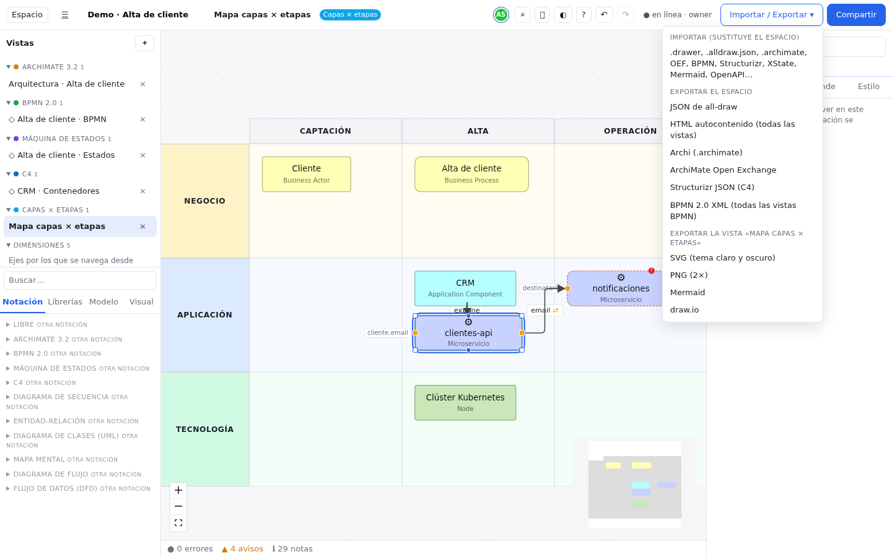

# Import and export

all-draw can open models you already have in other tools (Archi, Camunda, Drawer, Mermaid, OpenAPI…) and get your
work out as a backup, as an image, as a web page or in another tool's format. This chapter helps you choose the format
and guides you step by step.

## Where it is {#donde}

There are two places to import and one to export:

| Where | What it does |
|---|---|
| **Home → Import…** | Creates a **new workspace** from the file. If you are signed in, it is created on the server; if not, in this browser. This is the safest option: it does not touch anything you already have. |
| **Editor → Import / Export → Import (replaces the workspace)** | Loads the file **into the open workspace, replacing all of its content**. It asks for confirmation first. |
| **Editor → Import / Export → Export…** | Downloads the whole workspace or the current view in the format you choose. |

On a phone, **Import / Export** is in the **More** sheet. If the workspace is read-only you can export but not import.

> [!WARNING]
> Importing from the editor **replaces** the workspace content; it does not add to it. If the workspace contains
> anything you want to keep, first export an **all-draw JSON** or, in a server workspace, create a snapshot in
> [History](historial.md).

## Which format should I choose? {#que-formato}

| I want to… | Use | From |
|---|---|---|
| Make a **backup** or move a workspace to another server | **all-draw JSON** (`.alldraw.json`) | Export the workspace |
| Show the model to someone **without all-draw**, navigable | **Self-contained HTML** | Export the workspace |
| Put a diagram in a document or a presentation | **PNG (2×)** or **SVG** | Export the view |
| An image that looks good on both light and dark backgrounds (wiki, web) | **SVG (light and dark theme)** | Export the view |
| Bring in a model from **Archi** | `.archimate` | Import |
| Send a model back to **Archi** or another ArchiMate tool | `.archimate` or **Open Exchange** | Export the workspace |
| Bring processes in from, or out to, **Camunda, bpmn.io, Signavio, Bizagi…** | **BPMN 2.0 XML** | Import / export |
| Bring in a **Drawer** project | `.drawer` | Import |
| Paste a diagram into a GitHub or GitLab README | **Mermaid** | Export the view |
| Convert a Mermaid diagram you already have | `.mmd` | Import |
| Start from an **API** contract | **OpenAPI** (JSON or YAML) | Import |
| Keep editing a drawing in **draw.io / diagrams.net** | **draw.io** | Export the view |
| **C4** models from Structurizr | **Structurizr JSON** | Import / export |
| State machines for code (XState) | **XState JSON** | Import / export the view |

> [!TIP]
> Only the **all-draw JSON** keeps *everything*: dimensions, pins, rules, people, comments and the relationships
> between notations. The other formats keep what the other tool is able to represent.

## Importing step by step {#importar}

The procedure is always the same:

1. Get the file onto your computer (below, how to get it out of each tool).
2. On the home screen, press **Import…** and choose the file. (Or, to replace the open workspace, **Import / Export** →
   **Import (replaces the workspace)** and confirm.)
3. all-draw recognizes the format on its own and opens the workspace.
4. If something could not be kept, when importing from the editor you will see a **Warnings** window with the list
   (the first twelve and "… and *N* more").
5. Go through the views and open the [problems panel](editor.md#problemas) in case there is anything to check.

The file picker accepts `.drawer`, `.json`, `.archimate`, `.xml`, `.bpmn`, `.mmd`, `.yaml` and `.yml`.

### From Archi {#archi}

1. In Archi, save the model (**File → Save**): the file it saves is the `.archimate`.
2. In all-draw, **Home → Import…** and choose that file.
3. A view is created for each Archi view, with its *viewpoint*, colors, groups, notes and bend points. References to
   other views become detail links (double-click to enter), and profiles (*specializations*) become a
   `lib:archimate-profiles` library.

Archi sketches (*Sketch*) and canvases (*Canvas*) are not imported, and objects that cannot be represented become
notes. If your tool is not Archi but exports **ArchiMate Open Exchange** (`.xml`), import it the same way: all-draw
recognizes it by its content.

To go back to Archi: **Export the workspace → Archi (.archimate)** and open it with **File → Open** in Archi.

### From BPMN tools {#bpmn}

Camunda Modeler, bpmn.io, Signavio, Bizagi and most BPMN tools save or export **BPMN 2.0 XML** (`.bpmn` or `.xml`).

1. In your tool, save or export the process as BPMN 2.0 XML. If it lets you choose, include the diagram information
   (*diagram interchange*, DI): that is the position of every shape.
2. In all-draw, **Home → Import…** and choose the file.
3. A view is created for each diagram in the file, with pools, lanes, tasks, events, gateways, subprocesses, flows, bend
   points and colors. You can move in and out between diagrams by double-clicking.

Each tool's own extensions (for example Camunda's) are kept and **come back out when you export**, so you can go back
and forth without losing them. To export: **Export the workspace → BPMN 2.0 XML (all BPMN views)**, or from a BPMN view,
**BPMN 2.0 XML** for just that view (including its detail views).

BPMN views are checked with the [bpmnlint rules](#bpmnlint) and the failures show up in the problems panel.

### From Drawer {#drawer}

1. In Drawer, export the project: you will get a `.drawer` file (a `.json` one works too).
2. In all-draw, **Home → Import…** and choose it.
3. Result:
   - each Drawer library becomes a [library](librerias-reglas-personas.md#librerias) with its types, fields and
     components;
   - APIs and operations go to the `lib:apis` library, with request and response bodies as real
     [pins](conceptos.md#pines);
   - each diagram becomes a [Layers × stages](editor.md#rejilla) view with its layers, stages, groups and colors;
   - relationships keep pins, field mappings, color, width, style and direction; people, assignments and rules are
     imported too.

What changes: there are no bend points, all nodes have the same size (160×56) and each person's job title goes into
their notes. Only version 1 Drawer files are supported, and you cannot export back to `.drawer`.

### From Mermaid {#mermaid}

1. Copy the text of the Mermaid diagram and save it in a file with the `.mmd` extension (for example `process.mmd`).
   all-draw understands `flowchart` / `graph` and `stateDiagram-v2`.
2. **Home → Import…** and choose the file.
3. Since Mermaid does not store positions, all-draw arranges the nodes by levels. Tidy them up by hand or use **Auto
   layout**.

Node shapes, arrows (`-->`, `-.->`, `---`, `<-->`) with their text, `subgraph`s (as containers) and, in state diagrams,
`[*]`, composite states, parallel regions and `<<choice>>`, `<<fork>>`, `<<join>>` are kept. **Colors are not
kept**: Mermaid defines them with `classDef`, `style` and `linkStyle`, which are ignored (as are `click`, `direction`
and `note`).

To get a view out as Mermaid: **Export the view → Mermaid**. State views come out as `stateDiagram-v2`, ER views as
`erDiagram` (with cardinalities) and everything else as `flowchart`.

### From OpenAPI {#openapi}

1. Get the API specification (OpenAPI 3.x or Swagger 2.0) in JSON or YAML.
2. **Home → Import…** and choose it.
3. A workspace is created with the `lib:apis` library: one template API and one template operation per path and
   method, with servers, security, parameters, headers, response codes and tags. Request and response bodies are turned
   into a sample JSON and **each leaf is a pin**.
4. This importer **does not create views**: open a view, go to the **Libraries** tab of the palette and drag the
   operations from **Components**.

### Other formats {#otros}

- **Structurizr JSON** (C4): people, systems, containers, components and deployment, with their views and positions.
  Only Structurizr's JSON format; the DSL language (`.dsl`) is not recognized.
- **XState JSON**: a state machine. It has no positions, so states are laid out in a grid on import.
- **all-draw JSON**: restores a backup as it was, migrating older versions if needed.

## Exporting {#exportar}

The **Import / Export** menu has two sections:

- **Export the workspace**: all-draw JSON, Self-contained HTML (all views), Archi (.archimate), ArchiMate Open
  Exchange, Structurizr JSON (C4) and BPMN 2.0 XML (all BPMN views).
- **Export the view "…"**: SVG (light and dark theme), PNG (2×), Mermaid, draw.io and, depending on the view's
  notation, BPMN 2.0 XML or XState JSON.

The file is downloaded with the name of the workspace or view. If something does not fit the chosen format, a
**Warnings** window explains it.

### Backup {#copia}

1. **Import / Export → all-draw JSON**.
2. Keep the `.alldraw.json` wherever you keep your backups.
3. To restore it, **Home → Import…** (creates a new workspace with everything) or, to overwrite a workspace, **Import
   (replaces the workspace)** from the editor.

The output is stable: two exports of the same state produce exactly the same file, so you can keep it in Git and see
the differences. Server workspaces also have the [History](historial.md) of snapshots.

### Images {#imagen}

Open the view you want and choose:

- **SVG (light and dark theme)**: a vector image (scales without losing quality) that switches to light or dark colors
  on its own depending on the viewer's theme. Ideal for websites and wikis. It includes an accessible title and
  description.
- **PNG (2×)**: an ordinary image, at double resolution, using the theme you have on at the time. Ideal for documents
  and presentations.

Both look like the canvas: shapes, colors (including those from rules), containers, grid, pins and mapping labels.

### HTML for sharing {#html}

**Self-contained HTML (all views)** downloads a single web page that opens in any browser, offline and without
installing anything:

- an index of views grouped by notation;
- navigation through detail views, with a breadcrumb;
- for each element, the views it appears in; and the description of each view;
- a button to switch between light and dark theme.

It is a snapshot: it cannot be imported again and does not include every field of each element.

### Taking it to another tool {#a-otra-herramienta}

- **Archi / Open Exchange**: only ArchiMate content is exported; the rest (and grids) is left out with a warning.
- **BPMN 2.0 XML**: only BPMN views.
- **Structurizr**: only C4 content.
- **draw.io**: one view, with shapes, colors, nesting and bend points, to keep drawing in diagrams.net. It does not
  include documentation or pins and cannot be imported back into all-draw.
- **Mermaid** and **XState**: no positions or colors.

## How the format is recognized {#deteccion}

You do not have to say what format it is. all-draw looks at the extension (`.drawer`, `.archimate`, `.mmd`) and, if
that is not enough, at the content: the XML namespaces (Archi, Open Exchange, BPMN), the JSON keys (all-draw, Drawer,
Structurizr, XState, OpenAPI), the first line of Mermaid, or `openapi:` / `swagger:` in YAML. When importing from the
editor, the confirmation message tells you which format it detected.

## Format table {#formatos}

Full reference of what is kept and what is lost in each format.

| Format | Direction | Kept | Lost / warnings |
|---|---|---|---|
| **all-draw JSON** (`.alldraw.json`) | import and export | The whole workspace (model, views, positions, bend points, styles, libraries, rules, people, dimensions). Stable output (sorted keys): two exports of the same state are identical. Older schemas are migrated on import. | Nothing. It is the backup format. |
| **.drawer** (Drawer) | import | Libraries and types with fields; components (used or templates); APIs and operations as `lib:api`/`lib:apiOperation` with real **pins** on request/response; each diagram → *layers × stages* view with layers, stages, groups and colors; positions per cell, nesting and notes; `core:link` relationships with pins, field mappings, color, width, style and direction; people with assignments; rules with conditions; `dim_grid` dimension. | No bend points; fixed node size 160×56; the person's job title goes into notes. Warnings for missing types/APIs/cells/placements (never errors). Only `version: 1`. No export to `.drawer`. |
| **Archi** (`.archimate`) | import and export | Elements and relationships with their ids (including relationships on relationships), documentation, properties, profiles (→ `lib:archimate-profiles` library), folders; relationship fields (Junction and/or, `accessType`, `strength`, `directed`); views with viewpoint, groups, notes, view references (→ `detailViewId`), nesting, fill/line/font colors, alpha, bend points (converted from relative to absolute, round trip tested with Archisurance). | Archi sketches and canvases are not imported; unsupported objects become notes. On export, elements, relationships and views that are not ArchiMate (and grids) are left out with a warning. |
| **ArchiMate Open Exchange** (`.oef.xml`) | import and export | Same as Archi, plus per-language name/documentation, `propertyDefinitions`, organizations, viewpoint by name, `Container` → group, `Label` → note or view link, RGB colors with opacity, bend points. | Warnings for unknown viewpoints or property definitions. On export, negative coordinates are shifted and ids starting with a digit get an `id-` prefix. Non-ArchiMate content is left out with a warning. |
| **BPMN 2.0 XML** (`.bpmn`) | import and export | Full metamodel (bpmn-moddle): pools and participants (collapsed if it has no process), lanes, task types, subprocesses (event, ad hoc, transaction), events with definition/timer/condition, data, choreography, conversation, documentation, `isExpanded`; extensions (`extensionElements` and foreign attributes) are kept and come back on export; one view per `BPMNDiagram` with drill-down between them; positions relative to the parent, label position, waypoints → bend points, `bioc:`/`color:` colors. | Without DI the model is imported with no views (warning). Warnings for unsupported artifacts or nodes and for shapes without an element. On export, non-BPMN views and templates are ignored. Exporting a single view includes its detail views. |
| **Structurizr JSON** (C4) | import and export | People, systems, containers, components, deployment and infrastructure nodes; `External`, `technology`, tags, properties, description; hierarchy (`features.parentId`); relationships (also between instances); landscape/context/container/component/deployment views with x/y and `vertices` → bend points; routing; `dim_c4` dimension. | Dynamic and filtered views are not imported (warning); synthetic node sizes. On export, non-C4 content, `Boundary`s, the code level, components without a container and elements repeated in a view are left out with a warning; containers without a system go to "Sin sistema". |
| **XState JSON** | import and export (state view) | States by path (`a.b.c`), parallel, final, history; `entry`/`exit`, `description`, `meta`; initial pseudostate; transitions with event, guard (`cond`/`guard`), actions, `internal`, `after` (→ delay) and `always`; `.child` and `#id` targets. | The file has no positions: a grid layout is applied on import; positions, colors and bend points are lost on export. Fork/join/terminate are left out with a warning. Only offered when exporting from a state view. |
| **Mermaid** (`.mmd`) | imports `flowchart`/`graph` and `stateDiagram-v2`; also exports `erDiagram` | Nodes with a shape per type, `-->`, `-.->`, `---`, `<-->` edges with labels, nested `subgraph`s (containers; in a grid, one per layer); `[*]` states, composite states, parallel regions, `<<choice/fork/join>>`, `event [guard] / actions` labels. ER views are exported as `erDiagram` with attributes and cardinalities. | `classDef`, `class`, `style`, `linkStyle`, `click`, `direction`, `note` are ignored: **colors are lost**. No positions: level-based layout on import; positions, sizes, bend points and pins are lost on export. Warnings for unrecognised lines or unmatched `end`. |
| **draw.io** (`.drawio`) | export (one view) | Uncompressed `mxGraphModel`: shapes per type, colors, stroke, font, opacity, nesting (`container=1`), grid cells as containers, orthogonal edges with style, arrowheads, label and bend points; nodes with a detail view as `shape=process`. | No documentation, properties or pins. Warnings for nodes without an element or broken edges. Cannot be re-imported. |
| **OpenAPI 2.0/3.x** (JSON/YAML) | import | `lib:apis` library with one template API and one template operation per path+method: servers, security, version, `externalDocs`, headers, parameters, response codes, and request/response bodies as sample JSON generated from the schema (`$ref`, `allOf/oneOf`, enum, formats, cycles) → each leaf is a **pin**; tags and `deprecated`. | Creates no views (only templates to drag). Warnings for external `$ref`s, references not found or repeated operations. |
| **SVG** (one view) | export | Same look as the canvas: shapes, colors by type and by rules, containers, grid, edges with bend points and markers, visible pins, mapping labels; accessible `<title>`/`<desc>` and `data-*` attributes; **dual** theme (`prefers-color-scheme`). | It is an image: it cannot be re-imported. |
| **PNG** (one view, 2×) | export | The SVG rasterised with the current theme. | Nothing semantic. |
| **Self-contained HTML** | export | Every view as SVG with an index by notation, navigation via `detailViewId` and breadcrumbs, an "appears in" table per element, documentation of each view, dual theme with a toggle; inline CSS and JS with no external URLs. | Cannot be re-imported; does not include properties or detailed fields. |

## Included bpmnlint rules {#bpmnlint}

They run on every BPMN view and show up in the [problems panel](editor.md#problemas):

| Rule | Severity | What it checks |
|---|---|---|
| start-event-required | error | Every process or subprocess has a start event (not required for ad hoc or event subprocesses) |
| end-event-required | error | Every process or subprocess has an end event |
| no-disconnected | error | Node without sequence flows (exempt: boundary events, compensation, link, event subprocesses); offers to delete it |
| single-blank-start-event | error | More than one start event without a definition in the same process |
| no-implicit-split | warning | A node splits the flow without a gateway |
| no-duplicate-sequence-flows | error | Two flows with the same source and target; offers to delete the duplicate |
| label-required | warning | Missing label on pools, lanes, activities, events, diverging gateways or conditional flows |
| superfluous-gateway | warning | Gateway with one incoming and one outgoing flow |
| fake-join | warning | Activity receiving several flows without a gateway |
| no-inclusive-gateway-without-condition | error | Outgoing flow of an inclusive gateway with no condition and not default |
| bpmn-pool-rules | error | Sequence flow crossing pools, message flow inside one pool, or boundary event not attached to an activity |

## Common mistakes {#errores-comunes}

**"Could not import: No se reconoce el formato del fichero…"**
The second part of the message is shown in Spanish and means "the file format is not recognized": the content does not
match any supported format. Typical cases: a Structurizr model in DSL (`.dsl`) instead of JSON, a draw.io or Visio
file, an Excel/CSV export from Archi, or an arbitrary `.json`. Check in the [format table](#formatos) that your file
is one of them and, if it is BPMN or Open Exchange XML, that it has not been hand-edited and lost its namespaces.

**"El texto no parece un diagrama Mermaid soportado."**
("The text does not look like a supported Mermaid diagram.") Only `flowchart` / `graph` and `stateDiagram-v2` are
imported. `sequenceDiagram`, `classDiagram`, `erDiagram`, `gantt` and other diagrams are not.

**"I imported a Mermaid diagram and lost the colors."**
That is expected: Mermaid styles (`classDef`, `style`, `linkStyle`) are ignored. Add color back with a
[rule](librerias-reglas-personas.md#reglas) (for example by name or by type), which also applies across every view.

**"My Mermaid file does not show up in the file picker."**
It has another extension (`.txt`, `.md`). Rename it to `.mmd`.

**"I imported a BPMN file and there are no views."**
The file had no diagram information (DI), only the model. The elements are in the **Model** tab of the palette:
create a BPMN view, drag them in and use **Auto layout**. Better still, export again from your tool including the
diagram.

**"I imported an OpenAPI file and the canvas is empty."**
That is normal: the importer only creates templates. Find them in the **Libraries** tab of the palette, under
**Components**.

**"I imported from the editor and lost what I had."**
Importing from the editor replaces the workspace. In a server workspace, look for an earlier snapshot in
[History](historial.md) and restore it (they are created automatically as you work, and by hand). In a local workspace
you can only get it back if you had an `.alldraw.json` copy. To avoid the risk, import from the **home screen**, which
creates a new workspace.

**"I want to add a file to my workspace, not replace it."**
Merging two files is not possible today. Import the new one into a separate workspace (from the home screen), open it
in another tab, copy the nodes with **Ctrl+C** and paste them into your workspace with **Ctrl+V**: they are pasted as
copies.

**"I didn't see any warnings when importing from the home screen."**
Warnings are only shown on screen when importing from the editor. If you want to know what was left out, import from
the editor into an empty workspace.

**"I can't find the import option."**
You are in read-only mode (read-only link or **read-only** role): you can only export.

**"The SVG looks dark in my document."**
The light-and-dark SVG follows the viewer's theme. If you need a fixed look, export **PNG (2×)** with the theme you want
set in the bar.

**"Things are missing when I export to Archi."**
Archi only understands ArchiMate: anything in other notations (BPMN, C4, grids…) is left out with a warning. To lose
nothing, also save an **all-draw JSON**.

**"I don't get the XState or BPMN option under Export the view."**
Those options only appear when the open view is a state view (XState) or a BPMN view.
