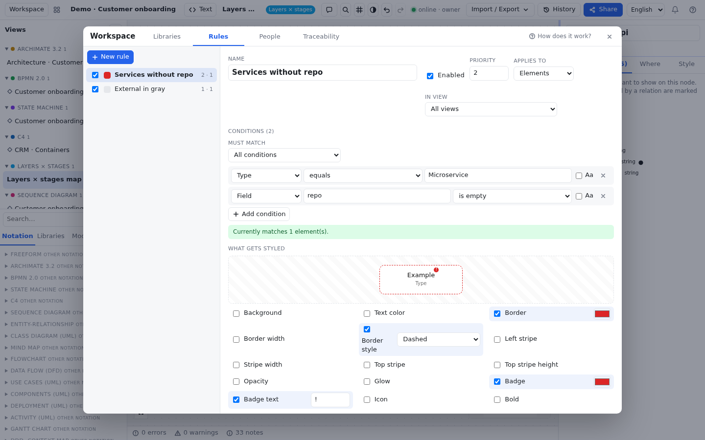

# Libraries, rules and people

Notations (ArchiMate, BPMN, C4…) come with their own element types. But every organization also has its own
vocabulary: *Microservice*, *Queue*, *API*, *Team*… and wants to see at a glance what is deprecated, who is responsible
for what, or what is still missing a connection. That is what the **Workspace** panel is for.

Open it with the **Workspace** button in the bar (on a phone, **More** sheet → **Workspace**) or with Ctrl+K → "Open
Workspace". It has four tabs: **Libraries**, **Rules**, **People** and **Traceability**. Close it with the close button
or **Esc**.

Everything you define here belongs to the workspace: it is saved with it, travels in the `.alldraw.json` export and
your collaborators see it instantly. In read-only mode the **Workspace** button does not appear.

## Libraries {#librerias}

A **library** is a box holding your own **element types** and your **components** (template elements). Library types
appear in the **Libraries** tab of the palette and can be used in any view, alongside the notation types.

To create one:

1. Open **Workspace** → **Libraries**.
2. Type a name in **New library…** and press Enter (or the **Create library** button next to it).
3. Select it in the list on the left and, if you like, write a **Description**.

To delete it, press **Delete library** next to its name. If elements use it, the panel warns you first: its
components are deleted and elements created from its types are left with an unknown type (they will show up in the
problems panel).

### Element types {#tipos}

A **type** defines how every element of that kind looks and what data it has. For example, the *Microservice* type can
be a blue rounded rectangle with the ⚙ icon and the fields *Repository*, *Team* and *Response*.

1. Inside the library, type the name in **New type…** and press Enter (or **Create type**).
2. Click the type to edit it:
   - **Name**.
   - **Category (palette)**: the section it will appear under in the palette (for example "Backend").
   - **Color** and **Icon (text or emoji)**, up to 4 characters.
   - **Shape**: rounded, rectangle, ellipse, diamond, hexagon, parallelogram, cylinder, note, actor, circle, double
     circle, bar, pool, lane, group, label or container.
   - **Container (can hold other nodes)**: tick it if you want to be able to [nest](editor.md#anidar) other nodes
     inside.
   - **Documentation**: shown as a tooltip when you hover over the type in the palette.
3. Add its **fields** (next section).

Changes to a type apply immediately to **all** its elements, in every view. Next to each type you can see how many
fields it has and how many elements use it.

If you delete a type that is in use, the panel asks **Reassign to…**: pick another type (from this library, another
one or a notation, or *Free box*) and press **Reassign and delete the type**. That way no element is left without a
type.

### Fields {#campos}

**Fields** are the data you will fill in on the **Data** tab of the inspector for each element of the type.

1. With the type open, type the label in **New field label…** and press Enter (or the **field** button).
2. Adjust each field:
   - **Label**: what is shown in the inspector.
   - **Internal field key**: the technical name (suggested from the label). Rules and exports use it, so it is best not
     to change it later.
   - **Field kind**, one of these:

     | Kind | What for |
     |---|---|
     | Text / Long text | One line or a paragraph |
     | Number | Quantities, versions, costs |
     | Selection | One option from a list (type the **comma-separated options**) |
     | Checkbox | Yes / no |
     | URL | Links (repository, documentation) |
     | Date | Dates |
     | List | Several values; each one can be a pin |
     | Key → value | Pairs, such as headers or environment variables; each pair can be a pin |
     | JSON | A structure, such as a request body; each leaf can be a pin |
     | Reference | A link to another element |

   - **required**: marks that the field should be filled in.
3. Reorder fields with **Move up** / **Move down** and remove them with **Remove field**.

### Pins on fields {#pines-en-campos}

A field can be turned into **pins**: connection points that say exactly which piece of data connects to which (see
[Pins](conceptos.md#pines) and [how to use them in the editor](editor.md#pines)).

- **JSON**, **List** and **Key → value** fields generate pins automatically: a JSON field gives one pin per leaf of the
  value you type (`customer.email`, `customer.name`…); a list or key → value field, one per entry.
- Any other field can produce a pin by ticking **generates pins** (or you can untick it on the automatic ones).
- With **generates pins** on, you choose the direction: **input** (the pin sits on the left of the node), **output**
  (on the right) or **both**.

> [!TIP]
> If you import a `.drawer` file or an OpenAPI specification, the `lib:apis` library already contains the APIs and
> their operations, with request and response bodies turned into pins. See [Import and export](importar-exportar.md).

### Components and templates {#componentes}

A **component** is a ready-filled sample element (for example "clientes-api", of type *Microservice*, with its
repository and team) that you can drag as many times as you like. Each time you drag it, an **instance** is created: a
new element with a copy of its data.

To create a component:

1. In the library, in the **Components** section, choose the type in the drop-down.
2. Type the **Component name…** and press Enter (or **Create component**).
3. Click it to fill in its documentation, fields and tags.
4. In the editor, open the **Libraries** tab of the palette: the component is under **Components**. Drag it onto the
   canvas.

**Propagating changes.** If you later change the component, the panel tells you how many instances will receive the
changes and shows the **Apply to *N* instances** button:

- only the fields the instance **had not changed** on its own are updated;
- fields someone edited by hand in an instance are kept (the panel says how many had overridden them);
- when everything matches, you will see "Instances are up to date with the component".

If you delete a component, its instances remain as standalone elements.

## Rules {#reglas}

A **rule** automatically styles the elements (or relationships) that meet some conditions. It is for "coloring by
data": seeing deprecated things in red, highlighting a team's work, flagging what has no owner… without going node by
node, and consistently across every view.

### Creating a rule step by step {#crear-regla}

1. Open **Workspace** → **Rules** and press **New rule**.
2. Give it a **Name** that explains what it does.
3. Choose what it **Applies to**: **Elements** or **Relations**, and **In view**: **All views** or a specific one.
4. Under **Conditions**, press **Add condition** and fill in each one:
   - the **source**: Field, Name, Documentation, Type, Notation, Library, Label (the element's tags), Property, View,
     Pin, Assigned person or Assigned role (for *Field* and *Property* also type the key);
   - the **operator**: equals, does not equal, contains, does not contain, is one of (comma-separated values), is
     empty, has a value, is greater than, is less than, matches the regular expression;
   - the **value**.

   By default case and accents are ignored ("Deprecated" = "deprecated"); tick **Aa** (Match case and accents) if you
   want them to count.
5. Under **Must match**, choose **All conditions** or **Any condition**.
6. Under **What gets styled**, tick what you want to change and pick the value. The preview shows a sample node:

   | Option | Effect |
   |---|---|
   | Background, Text color, Border | Node colors |
   | Border width, Border style | The border line: *Solid*, *Dashed* or *Dotted* |
   | Left stripe / Top stripe | A colored band along the edge, with its width or height |
   | Opacity | From 0 (invisible) to 1 (opaque); useful for dimming |
   | Glow | A colored halo around the node |
   | Badge and Badge text | A small mark in the corner, with a short text (for example "!") |
   | Icon | An emoji or text before the name |
   | Bold, Strikethrough | Formatting of the name |

7. Check the message under the conditions: "Currently matches *N* element(s)". If it says 0, review the conditions.

The **Enabled** checkbox (in the list or in the editor) turns the rule on or off without deleting it. **Duplicate**
makes a copy for variants and **Delete rule** removes it.

### Priority and collisions {#prioridad}

If several rules style the same element, for each property the one with the **highest Priority** (the biggest number)
wins. In the list, each rule shows its priority and how many elements it affects; a warning icon means it has no
conditions or that another rule overrides part of it. In the rule editor, the **Overridden by** section says which
rules win and on which properties.

A rule also wins over a node's manual style (the **Style** tab of the inspector). Manual style only affects one
occurrence; rules are the way to style by data in every view.

### Examples {#ejemplos}

**1. Paint deprecated things red.**
First, add the tag `deprecated` in the **Tags** field of the inspector for the deprecated elements. Then:

| Setting | Value |
|---|---|
| Name | Deprecated |
| Applies to | Elements · All views |
| Condition | Label · equals · `deprecated` |
| What gets styled | Background `#fee2e2`, Border `#dc2626`, Strikethrough |
| Priority | 10 |

**2. Highlight what a team owns.**
If you have created the person "Ana García" in **People** and assigned her to her elements:

| Setting | Value |
|---|---|
| Name | Ana's |
| Condition | Assigned person · equals · `Ana García` |
| What gets styled | Blue left stripe, width 5 |

If instead of a person you use a *Team* field from your library, the condition would be Field · key `team` · equals ·
`Payments`.

**3. Flag what has no owner.**

| Setting | Value |
|---|---|
| Name | No owner |
| Condition | Assigned person · is empty |
| What gets styled | Red badge with the text `!` and Opacity 0.6 |

**4. Dashed lines for legacy integrations (on relations).**
With **Applies to** = **Relations**, only Name, Documentation, Type, Notation, Property and Field are evaluated. For
example, Property · key `protocol` · equals · `SOAP`, styling **Border** orange (the line color) and **Border style**
*Dashed* (the line stroke).

> [!TIP]
> Tags, people and roles can have several values. The condition is met if **any** of them matches. That is why, for
> "no owner", you should use *is empty* and not *does not equal*.

## People {#personas}

**People** is the list of who takes part in the model: owners, analysts, support teams… It tells you whom to ask about
each piece, and lets you style or filter by owner.

> [!NOTE]
> People are **model content**, not user accounts. Being listed here does not give anyone access to the workspace,
> and having access does not mean you have to be listed here. Accounts and permissions are covered in
> [Sharing and collaborating](compartir-y-colaborar.md).

To create a person and assign them:

1. Open **Workspace** → **People**, type the name in **New person…** and press Enter (or **Create person**).
2. Fill in **Email**, **Team** and **Notes** if you like.
3. Under **Assignments**, choose:
   - what kind of thing you assign them to: **Element**, **View**, **Layer** or **Stage** (of a grid), **Type** or
     **Relation**;
   - which one, in the drop-down;
   - the **role** (suggestions include Owner, Stakeholder, Product Owner, QA…; you can also type your own).
4. Press **Assign**. Each assignment can have its own notes and is removed with **Remove assignment**.

**Shortcut from the inspector.** With an element selected, the **Data** tab of the inspector has a **People** section:
choose the person, type the role and press **Assign**. If there are no people yet, create them in the panel first.

Assignments to elements can be used in rules (**Assigned person**, **Assigned role**) and are exported with the
workspace.

## Traceability {#trazabilidad}

When you describe the same thing in several notations (a process in BPMN, the application that supports it in
ArchiMate, its states in a state machine), it is worth recording what corresponds to what. Those links are **traces**:
bridge relationships of type **Trace**, **Realizes** or **Refines** (see [Traces](conceptos.md#trazas)). The
**Traceability** tab shows you what is linked, what is missing, and suggests links.

You need elements from at least two notations; otherwise the tab tells you so. You can also open it from the "*N*
traces across dimensions" link in the **Model** section of the Views panel.

### The matrix {#matriz}

1. Choose one notation under **Rows** and another under **Columns** (the **Swap** button flips them). You can
   **Filter by name…**.
2. At the top you will see the coverage, for example "12 of 15 BPMN elements are traced to ArchiMate".
3. In the table, each cell crosses two elements:
   - **●**: they are already linked (hover to see the relationship type);
   - **○**: there is a **suggestion**; the stronger it looks, the more confident it is. Hover to see why, and click to
     create the trace;
   - empty: nothing to say.
4. Click a row or column name to go to that element on the canvas.

With large models the table shows only part of it ("Showing *X* of *Y* rows…"); use the filter to narrow it down.

### Gaps and suggestions {#huecos}

Below the matrix, **Gaps** lists the elements of both notations that have no trace at all, with their best suggestion
(target, relationship type and score):

- **Link best suggestion** creates that trace for one element.
- **Link all suggestions with score ≥ 80 %** creates them all at once (and **Ctrl+Z** undoes them in one go).

Suggestions are scored like this: same name (100 %), one appears in the other's detail view (80 %), they share at least
two meaningful words (50 %), plus a bonus if the types usually correspond (for example a BPMN pool and an ArchiMate
actor).

The same traces and suggestions for a single element are in the **Where** tab of the inspector, and untraced elements
show up as notes in the [problems panel](editor.md#problemas).

## Common mistakes {#errores-comunes}

**"I can't see my type in the palette."**
It is in the **Libraries** tab of the palette, not in **Notation**, under the category you gave it. If the
**Search…** field has text in it, clear it.

**"I ticked generates pins and no pin appears."**
JSON, List and Key → value pins come from each element's **value**: if the field is empty, there are no pins. Also,
each node decides which pins it shows: open the **Pins** tab of the inspector and press **All**.

**"I changed the component and the instances did not change."**
Changes are not applied automatically: press **Apply to *N* instances**. Fields someone changed by hand in an instance
are left alone.

**"My rule says it matches 0 elements."**
Check the source and the key (for *Field*, the internal key, not the label), and untick **Aa** if you ticked it. A rule
with no conditions styles nothing, and neither does a disabled rule.

**"My rule does not show on an element even though it matches."**
Another rule with higher priority wins on that property: look at **Overridden by**. Also check that **In view** is not
limited to another view.

**"The Type condition stops working when I change language."**
*Type* compares against the type name as displayed, which changes with the interface language. For rules that work in
any language, use *Notation* (which compares against the identifier, such as `bpmn` or `archimate`), a tag or a field.

**"The Traceability tab is empty."**
The model only has elements from one notation. Draw something in another notation (for example with **Open in another
dimension** from a node's menu) and come back.
