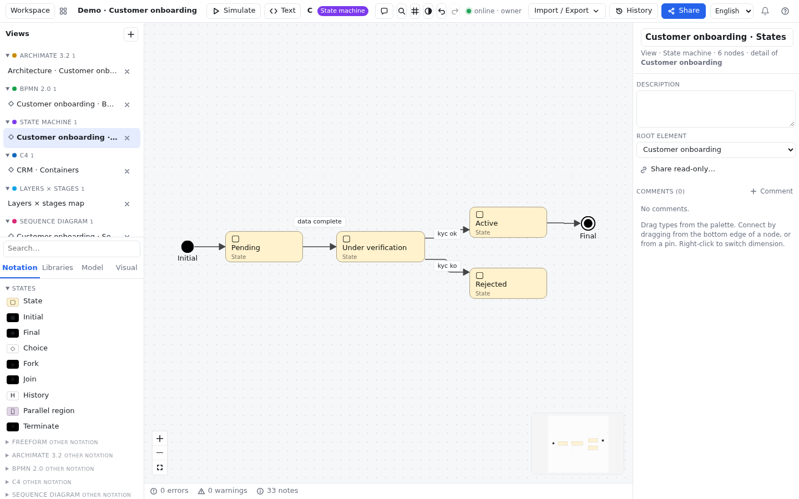

# State machine

## What it is and when to use it {#que-es}

A state machine describes the **life cycle** of a thing: which situations (states) it can be in and what
makes it move from one to another (transitions). For example, an onboarding request is *Pending*, moves
to *Under verification* when the details arrive and ends up *Active* or *Rejected*.

Use it for orders, accounts, files, tickets, application screens or any object whose behavior depends
on "where it is". It follows the style of UML statecharts and XState: states can contain states, and
regions can run in parallel.

## Key elements {#elementos-clave}

| Element | Shape | What it represents |
|---|---|---|
| **State** | Rounded rectangle | A stable situation. If it contains other states it is a **composite state**. Fields `entry` and `exit` (actions when entering and leaving) and `activities` (what is done while it lasts) |
| **Initial** | Black dot | Where the machine (or a composite state) starts. It can only be a source |
| **Final** | Dot with a ring | The end. It can only be a target |
| **Choice** | Diamond | A point where the next state is chosen by a guard |
| **Fork** / **Join** | Black bar | Splits a transition into several regions / joins them back |
| **Parallel region** | Rectangle with a dashed border | A part that runs at the same time as others inside the same state |
| **History** | Circle with H | Returns to the last substate that was active (`H*` if the `deep` field is ticked) |
| **Terminate** | Circle with X | Stops the whole machine |

## Relations {#relaciones}

There is only one: the **Transition** (solid arrow). Its fields make up the classic label
`event [guard] / actions`:

| Field | What for | Example |
|---|---|---|
| `event` | What triggers the change | `kyc ok` |
| `guard` | A condition that must hold | `amount < 1000` |
| `actions` | What runs during the change, one per line | `send email` |
| `delay` | A timed transition | `after 500ms` |
| `internal` | The transition doesn't leave the state (entry/exit don't run) | |

## Getting started {#como-empezar}

This is how the demo's state view (*Alta de cliente · Estados*, "customer onboarding") is built:

1. In the **Views** panel, press **＋** and choose **State machine**.
2. Drag an **Initial** and four **State**: "Pending", "Under verification", "Active" and "Rejected". Add a
   **Final**.
3. Join the initial to "Pending": drag from the bottom edge of one to the other and choose **Transition**
   in the picker (it comes first).
4. Join "Pending" to "Under verification" and, with the transition selected, type the event
   `details complete` in the inspector.
5. Join "Under verification" to "Active" (event `kyc ok`) and to "Rejected" (event `kyc ko`).
6. On "Under verification", fill in `entry` with `start KYC`.
7. Join "Active" to the **Final**.

For a composite state, drag states *inside* another state; for parallel regions, put two **Parallel
region** inside the composite state and each substate inside its region.

## Notation rules {#reglas}

- **Pseudostates with meaning**: the initial only goes out (to a state, a choice or a fork); final and
  terminate only receive; a fork spreads to states or regions; history only points to a state.
- **Nesting without a relation**: composite states and regions are expressed by putting nodes inside a
  **State** or a **Parallel region**. No relation is created when nesting.
- The validity matrix only offers **Transition** between the allowed pairs. Otherwise (for example, out of
  a final) the picker only shows the core bridge relations, which are not transitions.

## Import and export {#importar-exportar}

- **XState JSON**: import and export states (also nested and parallel), events, guards, actions, delays
  and internal transitions. The file stores no positions: they are laid out automatically on import.
- **Mermaid `stateDiagram-v2`**: import and export, with composite states, parallel regions and choices.
- Details and limitations in the [format table](../importar-exportar.md#formatos).

## Common mistakes {#errores-comunes}

- **Putting the condition in the transition's name** instead of in `event` and `guard`: it looks the same,
  but XState and Mermaid don't export it as such.
- **States that are actions** ("Send email"): a state is a situation ("Waiting for confirmation"); the
  action goes on the transition or in `entry`.
- **Forgetting the initial** inside a composite state: it is unclear which substate is entered.
- **Using Choice to wait for an event**: a choice is resolved instantly with guards; if you have to wait,
  it is a state.

## Full reference {#referencia}

The complete list of types, relations, validity matrix and viewpoints is generated from the pack itself:

<!-- docs:notation-ref statechart -->
