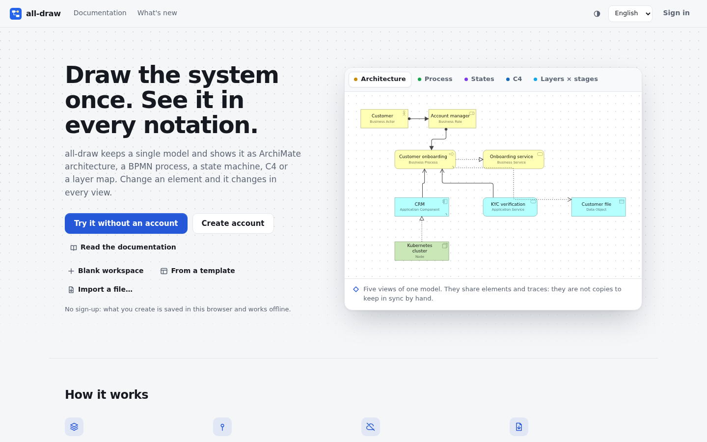
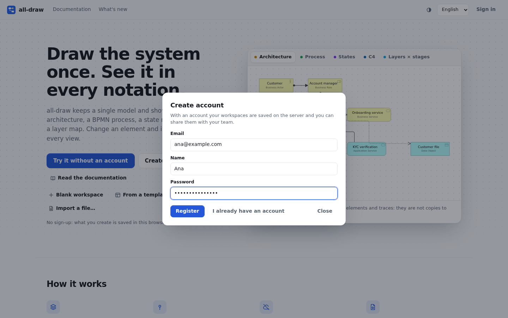
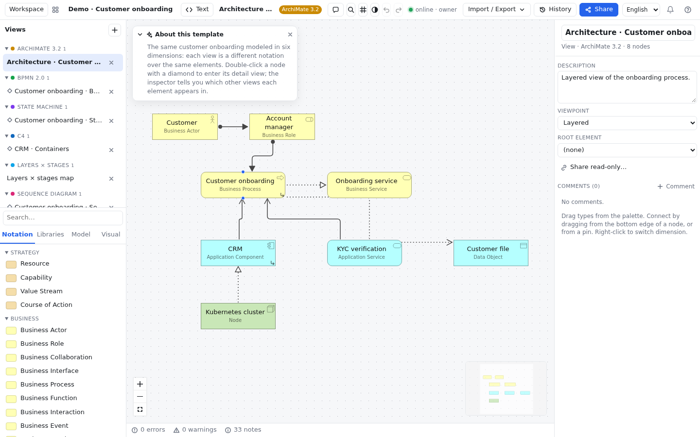

# Getting started

all-draw is a diagramming tool where you draw **a single model** and look at it through **many notations**:
ArchiMate, BPMN, state machine, C4, sequence, entity-relationship, UML, mind map and more. An element
("Alta de cliente", customer onboarding) exists only once and can appear in as many views as you like; rename
it in one and it changes everywhere. It runs in the browser, with nothing to install, at
[alldraw.bezenti.com](https://alldraw.bezenti.com).

> [!TIP]
> In a hurry? Jump to [Your first diagram in 5 minutes](primeros-pasos.md#primer-diagrama). Want to
> understand the idea before drawing? Read [Concepts](conceptos.md).

## What all-draw is {#que-es}

Most tools treat each diagram as an isolated drawing: if the same application shows up in the architecture
diagram and in the process diagram, they are two different boxes you have to keep in sync by hand. all-draw
has two layers:

- The **model**: the things that exist (processes, applications, people, data…) and how they relate.
- The **views**: the diagrams. Each view draws part of the model in a specific notation.

That is what lets you jump from a business process to its BPMN detail, from there to the state machine of the
case file, and check which pieces are not connected across levels. All of this is explained with drawings in
[Concepts](conceptos.md).

## The home screen {#pantalla-de-inicio}

When you open the app you see a short introduction, three buttons and, below them, your workspaces:

| Button | What it does |
|---|---|
| **New workspace** | Creates an empty workspace and opens it in the editor. When you are signed in it is called **New workspace on the server**. |
| **Open the demo** | Creates a copy of the sample workspace "Alta de cliente" (see [the demo](primeros-pasos.md#demo)). Feel free to change it: it is yours. |
| **Import…** | Creates a workspace from a file: `.drawer`, `.alldraw.json`, `.archimate` (Archi), Open Exchange, BPMN 2.0 XML, Structurizr, XState, Mermaid or OpenAPI. See [Import and export](importar-exportar.md). |

On the same row, to the right, **Sign in / register** appears if the account server is available. The first
time, while you have no workspace and are not signed in, you see the all-draw landing page instead of the home
screen; there the button to sign in is called **Sign in**. The **language selector** is at the top of the screen.

A **workspace** is the unit of work: it holds the model, all its views, the libraries, the style rules and
the people. Each workspace opens at its own web address, so you can bookmark it.

The list of workspaces has two sections:

- **On the server**: only shown when you are signed in. Lists each workspace with your role (**owner**,
  **can edit** or **read-only**) and the date of the last change. The owner sees a **Delete** button.
- **In this browser**: local workspaces. Each one has **Delete** and, when you are signed in,
  **Upload to server**.

Click the name (or anywhere on the row) to open a workspace.

## Local workspaces and server workspaces {#espacios-locales-y-servidor}

all-draw works without an account. What you create without signing in is **local**: it lives in your
browser's storage. With an account you can keep workspaces **on the server** and share them.

| | Local workspace | Server workspace |
|---|---|---|
| Where it lives | In **this browser** (on this computer) | On the server, with a copy in your browser |
| Address | `…/#/w/<id>` | `…/#/s/<id>` |
| Needs an account | No | Yes (or a share link) |
| Works offline | Always | Yes: saves locally and syncs when the connection is back |
| Can be shared | No (upload it first) | Yes: edit and read-only links, simultaneous editing |
| Version history | No | Yes (see [History](historial.md)) |
| It is lost if… | You clear the browser data or switch computers | Its owner deletes it |

> [!WARNING]
> A local workspace is **not** copied anywhere automatically. If you clear your browsing data, use a private
> window or switch computers, you will not see it. To keep it safe, upload it to the server or export it to an
> `.alldraw.json` file (see [Import and export](importar-exportar.md)).

To move a local workspace to the server: sign in and press **Upload to server**, either in the home list or
in the editor toolbar. A **copy** is created on the server and opened; the local workspace stays until you
delete it.

More details in [Concepts → Workspaces](conceptos.md#espacios).

## Creating an account {#crear-cuenta}

You need an account to keep workspaces on the server, share them, see their history and create keys for
agents.

1. On the home screen, press **Sign in / register** (top right; on the landing page it is called **Sign in**).
2. In the dialog, press **I don't have an account**. The title changes to **Create account**.
3. Fill in **Email**, **Name** and **Password** (at least 8 characters).
4. If the server asks for an **Invite code**, type it in (the server administrator gives it to you).
5. Press **Register**. The dialog closes and you are signed in.

To **sign in** with an existing account: **Sign in / register**, type your email and password and press
**Sign in**. The **I already have an account** link takes you back from registration to sign-in.

Once signed in:

- The first button becomes **New workspace on the server** and **Open the demo** creates the demo on the
  server.
- The **On the server** section appears.
- In the top-right corner you see your name. Clicking it opens the account menu, with **Account and API keys** and
  **Sign out**.

**Account and API keys** opens the **Account** screen, where you can create keys for agents (see
[Agents and API](agentes-y-api.md)), **Change password**, see your **Active sessions** and close the ones
you do not recognise, and **Sign out everywhere**. If you are an administrator, the **Server users** list
is there too.

Next to your name there is the notification **bell**: it tells you when someone mentions you in a
comment, shares a workspace with you, changes your role or restores a version of one of your workspaces
(see [notifications](compartir-y-colaborar.md#notificaciones)). If the server sends emails, signing up
sends you a link to **confirm your email** (see [confirming your email](compartir-y-colaborar.md#verificar-correo)).

The session lasts 30 days and renews itself while you use the app. The first user to register on a server
becomes its administrator.

> [!NOTE]
> Each server decides whether registration is **open**, **invite-only** or **closed**. If it is closed, the
> dialog says so ("Registration is closed on this server.") and the **Register** button is disabled: ask the
> server administrator for an account.

## Your first diagram in 5 minutes {#primer-diagrama}

Let's draw a tiny BPMN process: *Order received → Prepare order → Order shipped*.

1. On the home screen press **New workspace**. The editor opens with an empty workspace.
2. At the top, click the name "New workspace" and type your own, for example *Shop*.
3. In the **Views** panel (left column), press the **+** button and choose **BPMN 2.0**. The view
   "New BPMN 2.0 view" is created and opened.
4. Click an empty area of the canvas: the **inspector** (right column) shows the view. Rename it to
   *Order process*.
5. In the **palette** (below Views), **Notation** tab, find **Start event** and **drag** it onto the canvas.
6. With the new node selected, press **F2**, type *Order received* and press **Enter**.
7. Repeat with a **Task** (*Prepare order*) and an **End event** (*Order shipped*), placed from left to right.
   You can use the palette's **Search…** box to find them faster.
8. Connect them: move the mouse to the **bottom edge** of *Order received* until you see the connection point,
   drag to *Prepare order* and release. In the **Relationship type** menu choose **Sequence flow** (it is listed
   first). Do the same from *Prepare order* to *Order shipped*.
9. Look at the bar at the bottom of the canvas: it is the **problems panel**. If something breaks the BPMN
   rules, it will tell you there.
10. Done. There is nothing to save: the status indicator in the toolbar says `saved in this browser`.

> [!TIP]
> Made a mistake? **Ctrl+Z** undoes and **Ctrl+Y** redoes (on a Mac, **Cmd+Z** and **Cmd+Y**). All the
> shortcuts are in [Shortcuts](atajos.md).

Next: select *Prepare order* and look at the inspector (tabs **Data**, **Pins**, **Where**, **Style**). Then
try creating another view and dragging *Prepare order* from the palette's **Model** tab: you will see the same
element in two views. That is what [Model and views](modelo-y-vistas.md) explains.

## The "Alta de cliente" demo {#demo}

The demo is the best way to understand all-draw. It models how a bank onboards a new customer and draws the
same model in **six dimensions**. Its content follows the language of the interface:

| View | Notation | What it shows |
|---|---|---|
| Arquitectura · Alta de cliente | ArchiMate 3.2 (*Layered* viewpoint) | Actor, role, process, service, components, data and node |
| Alta de cliente · BPMN | BPMN 2.0 | The process step by step, with a "Banco" (bank) pool and two lanes |
| Alta de cliente · Estados | State machine | The life cycle of the case: pending, under verification, active, rejected |
| CRM · Contenedores | C4 (*Container* viewpoint) | The CRM containers (portal, API, database) and the external KYC provider |
| Alta de cliente · Secuencia | Sequence diagram | Customer, portal, API and database exchanging messages |
| Mapa capas × etapas | Layers × stages | The same elements in a Business/Application/Technology × Acquisition/Onboarding/Operation grid, with two microservices from a library connected through **pins** |

It also includes two style rules ("Externos en gris", external ones in gray, and "Servicios sin repo",
services without a repository), a "Sistemas" library with the *Microservicio* type, and several **traces**
between notations (for example, the BPMN task "Verificar identidad" is traced to the ArchiMate service
"Verificación KYC").

Open it with **Open the demo** and try these four things:

1. **Double-click** the "Alta de cliente" process in the ArchiMate view: you enter its BPMN detail view. The
   **view path** appears at the top, with the **back** button to return.
2. **Right-click** any node → **Open in another dimension**: the list of dimensions. The ones that already have
   a view open it; the ones marked **(create)** create a new view.
3. In "Mapa capas × etapas", select `clientes-api` and open the inspector's **Pins** tab: you will see the
   `cliente.email` pin connected to `notificaciones`.
4. Select any element and open the **Where** tab: it lists every view where the element appears.

## Autosave and status indicator {#guardado}

There is no save button. Every change is saved immediately in your browser and, if the workspace is on the
server, sent as soon as there is a connection. The indicator in the editor toolbar tells you the state:

| Indicator | Meaning |
|---|---|
| `saved in this browser` | Local workspace. Everything is saved in this browser. |
| `● online` | Server workspace, connected. Changes are sent instantly. |
| `◌ connecting…` | Trying to reach the server. You can keep working. |
| `○ offline (syncs when back)` | No connection. Your changes are kept locally and sent when the network returns. |

In server workspaces your role (**owner**, **can edit** or **read-only**) is shown next to the indicator. With
**read-only** you can look but not edit.

Server workspaces also keep automatic **snapshots** that you can restore from the **History** button (see
[History](historial.md)).

## Installing as an app (PWA) {#instalar-pwa}

all-draw is an **installable web app** (PWA): you can have it on your desktop or on your phone's home screen;
it opens in its own window and loads even when you are offline.

1. Open [alldraw.bezenti.com](https://alldraw.bezenti.com) in Chrome, Edge or another compatible browser.
2. On a computer: click the **install** icon in the address bar (or browser menu → *Install all-draw*).
3. On a phone: browser menu → *Add to Home screen* (in Safari on iPhone, *Share* button → *Add to Home
   Screen*).

The installed app updates itself when a new version is available. Your workspaces are the same as in the
browser where you installed it.

## Language {#idioma}

The interface is available in **Spanish** and **English**. The first time, it follows your browser's
language (English if your browser is set to English; Spanish otherwise).

To change it, use the **Español / English** selector: it is at the top of the home screen and also in the
editor toolbar (on a phone, inside the **More** sheet). The change is immediate and remembered in this browser.

> [!NOTE]
> The language changes the interface texts and the names of the palette's types and categories. It does
> **not** translate what you write (element names, documentation). ArchiMate type names stay in English in
> both languages, as in the specification.

## Common problems {#problemas-frecuentes}

**I can't see the "Sign in / register" button (or "Sign in" on the landing page).**
It only appears when the account server responds. Check your connection and reload the page. Meanwhile you
can work with local workspaces.

**My workspaces have disappeared.**
If they were local, they live in the browser where you created them: make sure you are using the same browser
and profile, and not a private window. If you cleared the site's data, the local workspaces are gone. That is
why it pays to upload them to the server or export them.

**I forgot my password.**
Press **Sign in → Forgot your password?**. If the server sends emails, it sends you a link (one hour,
single use) to choose a new one (see [I forgot my password](compartir-y-colaborar.md#recuperar-contrasena)).
If not, ask the server administrator to reset it from **Account → Server users → Reset**: you will get a
temporary password that you can then change in **Change password**.

**"Upload to server" says I need an account.**
Sign in first on the home screen and press **Upload to server** again.

**The indicator stays at `○ offline`.**
Your changes are not lost: they are still in the browser. They are sent automatically when the connection
comes back. If it takes too long, reload the page.

**I can't edit anything in a shared workspace.**
Check your role next to the indicator: with **read-only** (or with a read-only link) you can only look. Ask the
owner for an edit link (see [Sharing and collaborating](compartir-y-colaborar.md)).

## Next steps {#siguientes-pasos}

- [Concepts](conceptos.md): model and views, dimensions, pins, traces and viewpoints, with drawings.
- [The editor](editor.md): every area of the screen and how to use it.
- [Model and views](modelo-y-vistas.md): creating views, navigating between dimensions, removing and deleting.
- [Shortcuts](atajos.md): keyboard, mouse and touch gestures.
- [FAQ](faq.md): common questions.
