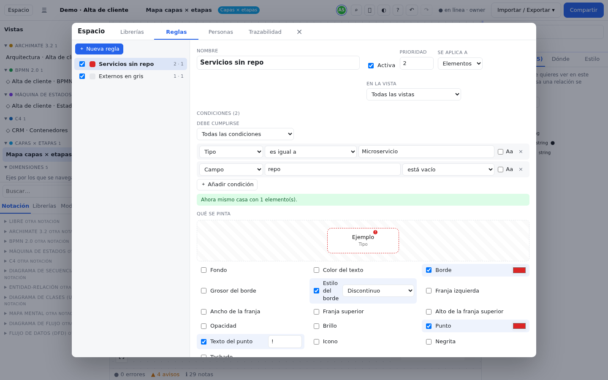

# Librerías, reglas y personas

Las notaciones (ArchiMate, BPMN, C4…) traen sus propios tipos de elemento. Pero cada organización tiene además su
vocabulario: *Microservicio*, *Cola*, *API*, *Equipo*… y quiere ver de un vistazo qué está obsoleto, quién es
responsable de qué o qué falta por conectar. Para eso está el panel **Espacio**.

Ábrelo con el botón **Espacio** de la barra (en el móvil, hoja **Más** → **Espacio**) o con Ctrl+K → "Abrir Espacio".
Tiene cuatro pestañas: **Librerías**, **Reglas**, **Personas** y **Trazabilidad**. Se cierra con el botón de cerrar o
con **Esc**.

Todo lo que defines aquí pertenece al espacio: se guarda con él, viaja en la exportación `.alldraw.json` y lo ven al
instante tus colaboradores. Si estás en modo solo lectura, el botón **Espacio** no aparece.

## Librerías {#librerias}

Una **librería** es una caja con tus **tipos de elemento** propios y tus **componentes** (elementos plantilla). Los
tipos de las librerías aparecen en la pestaña **Librerías** de la paleta y se usan en cualquier vista, junto con los
de las notaciones.

Para crear una:

1. Abre **Espacio** → **Librerías**.
2. Escribe un nombre en **Nueva librería…** y pulsa Enter (o el botón **Crear librería** que hay al lado).
3. Selecciónala en la lista de la izquierda y, si quieres, escribe una **Descripción**.

Para borrarla, pulsa **Borrar librería** junto a su nombre. Si tiene elementos que la usan, el panel te avisa antes: sus
componentes se borran y los elementos creados con sus tipos se quedan con un tipo desconocido (saldrán en el panel
de problemas).

### Tipos de elemento {#tipos}

Un **tipo** define cómo se ve y qué datos tiene cada elemento de esa clase. Por ejemplo, el tipo *Microservicio* puede
ser un rectángulo redondeado azul con el icono ⚙ y los campos *Repositorio*, *Equipo* y *Respuesta*.

1. Dentro de la librería, escribe el nombre en **Nuevo tipo…** y pulsa Enter (o **Crear tipo**).
2. Haz clic en el tipo para editarlo:
   - **Nombre**.
   - **Categoría (paleta)**: el apartado en el que aparecerá en la paleta (por ejemplo, "Backend").
   - **Color** y **Icono (texto o emoji)**, de hasta 4 caracteres.
   - **Forma**: redondeado, rectángulo, elipse, rombo, hexágono, paralelogramo, cilindro, nota, actor, círculo,
     círculo doble, barra, pool, carril, grupo, etiqueta o contenedor.
   - **Contenedor (puede contener otros nodos)**: márcalo si quieres poder [anidar](editor.md#anidar) otros nodos
     dentro.
   - **Documentación**: aparece como ayuda al pasar el ratón por el tipo en la paleta.
3. Añade sus **campos** (siguiente apartado).

Los cambios en un tipo se aplican al momento a **todos** sus elementos, en todas las vistas. Junto a cada tipo verás
cuántos campos tiene y cuántos elementos lo usan.

Si borras un tipo que está en uso, el panel te pregunta **Reasignar a…**: elige otro tipo (de esta librería, de otra o
de una notación, o *Caja libre*) y pulsa **Reasignar y borrar el tipo**. Así ningún elemento se queda sin tipo.

### Campos {#campos}

Los **campos** son los datos que rellenarás en la pestaña **Datos** del inspector para cada elemento del tipo.

1. Con el tipo abierto, escribe la etiqueta en **Etiqueta del campo nuevo…** y pulsa Enter (o el botón **campo**).
2. Ajusta cada campo:
   - **Etiqueta**: lo que se ve en el inspector.
   - **Clave interna**: el nombre técnico (se propone a partir de la etiqueta). Es la que usan las reglas y las
     exportaciones, así que conviene no cambiarla después.
   - **Clase de campo**, una de estas:

     | Clase | Para qué |
     |---|---|
     | Texto / Texto largo | Una línea o un párrafo |
     | Número | Cantidades, versiones, costes |
     | Selección | Una opción de una lista (escribe las **opciones separadas por coma**) |
     | Casilla | Sí / no |
     | URL | Enlaces (repositorio, documentación) |
     | Fecha | Fechas |
     | Lista | Varios valores; cada uno puede ser un pin |
     | Clave → valor | Pares, como cabeceras o variables de entorno; cada par puede ser un pin |
     | JSON | Una estructura, como el cuerpo de una petición; cada hoja puede ser un pin |
     | Referencia | Un enlace a otro elemento |

   - **obligatorio**: marca que el campo debería rellenarse.
3. Ordena los campos con **Subir** / **Bajar** y quítalos con **Quitar campo**.

### Pines en los campos {#pines-en-campos}

Un campo puede convertirse en **pines**: puntos de conexión que dicen exactamente qué dato se conecta con qué (ver
[Pines](conceptos.md#pines) y [cómo usarlos en el editor](editor.md#pines)).

- Los campos **JSON**, **Lista** y **Clave → valor** generan pines automáticamente: un campo JSON da un pin por cada
  hoja del valor que escribas (`cliente.email`, `cliente.nombre`…); una lista o un clave → valor, uno por entrada.
- Cualquier otro campo puede dar un pin marcando **genera pines** (o puedes desmarcarlo en los automáticos).
- Con **genera pines** activo eliges la dirección: **entrada** (el pin sale a la izquierda del nodo), **salida** (a
  la derecha) o **ambas**.

> [!TIP]
> Si importas un `.drawer` o una especificación OpenAPI, la librería `lib:apis` ya trae las APIs y sus operaciones
> con los cuerpos de petición y respuesta convertidos en pines. Ver [Importar y exportar](importar-exportar.md).

### Componentes y plantillas {#componentes}

Un **componente** es un elemento de ejemplo ya relleno (por ejemplo, "clientes-api", de tipo *Microservicio*, con su
repositorio y su equipo) que puedes arrastrar tantas veces como quieras. Cada vez que lo arrastras se crea una
**instancia**: un elemento nuevo con una copia de sus datos.

Crear un componente:

1. En la librería, en el apartado **Componentes**, elige el tipo en el desplegable.
2. Escribe el **Nombre del componente…** y pulsa Enter (o **Crear componente**).
3. Haz clic en él para rellenar su documentación, sus campos y sus etiquetas.
4. En el editor, abre la pestaña **Librerías** de la paleta: el componente está en el apartado **Componentes**.
   Arrástralo al lienzo.

**Propagar cambios.** Si después cambias el componente, el panel te dice cuántas instancias recibirán los cambios y
muestra el botón **Aplicar a *N* instancias**:

- solo se actualizan los campos que la instancia **no había modificado** por su cuenta;
- los que alguien cambió a mano en una instancia se respetan (el panel indica cuántas los tenían sobrescritos);
- cuando todo coincide, verás "Las instancias están al día con el componente".

Si borras un componente, sus instancias siguen existiendo como elementos sueltos.

## Reglas {#reglas}

Una **regla** pinta automáticamente los elementos (o relaciones) que cumplen unas condiciones. Sirve para "colorear
por datos": ver en rojo lo obsoleto, resaltar lo de un equipo, marcar lo que no tiene responsable… sin tener que ir
nodo por nodo, y de forma coherente en todas las vistas.

### Crear una regla paso a paso {#crear-regla}

1. Abre **Espacio** → **Reglas** y pulsa **Nueva regla**.
2. Ponle un **Nombre** que explique qué hace.
3. Elige a qué **Se aplica a**: **Elementos** o **Relaciones**, y **En la vista**: **Todas las vistas** o una
   concreta.
4. En **Condiciones**, pulsa **Añadir condición** y rellena cada una:
   - la **fuente**: Campo, Nombre, Documentación, Tipo, Notación, Librería, Etiqueta, Propiedad, Vista, Pin, Persona
     asignada o Papel asignado (para *Campo* y *Propiedad* escribe también la clave);
   - el **operador**: es igual a, no es igual a, contiene, no contiene, es alguno de (valores separados por coma),
     está vacío, tiene algún valor, es mayor que, es menor que, cumple la expresión regular;
   - el **valor**.

   Por defecto no se distinguen mayúsculas ni tildes ("Deprecated" = "deprecated"); marca **Aa** si quieres que sí.
5. En **Debe cumplirse**, elige **Todas las condiciones** o **Alguna condición**.
6. En **Qué se pinta**, marca lo que quieres cambiar y elige el valor. La vista previa muestra un nodo de ejemplo:

   | Opción | Efecto |
   |---|---|
   | Fondo, Color del texto, Borde | Colores del nodo |
   | Grosor del borde, Estilo del borde | Línea del borde: *Continuo*, *Discontinuo* o *Punteado* |
   | Franja izquierda / Franja superior | Una banda de color en el borde, con su ancho o alto |
   | Opacidad | De 0 (invisible) a 1 (opaco); útil para atenuar |
   | Brillo | Un halo de color alrededor |
   | Punto y Texto del punto | Una marca pequeña en la esquina, con un texto corto (por ejemplo "!") |
   | Icono | Un emoji o texto antes del nombre |
   | Negrita, Tachado | Formato del nombre |

7. Comprueba el aviso de debajo de las condiciones: "Ahora mismo casa con *N* elemento(s)". Si dice 0, revisa las
   condiciones.

La casilla **Activa** (en la lista o en el editor) enciende o apaga la regla sin borrarla. **Duplicar** crea una
copia para hacer variantes y **Eliminar regla** la borra.

### Prioridad y colisiones {#prioridad}

Si varias reglas pintan el mismo elemento, en cada propiedad gana la de **mayor Prioridad** (el número más alto). En
la lista, cada regla muestra su prioridad y cuántos elementos afecta; un icono de aviso indica de que no tiene condiciones o de
que otra regla le pisa algo. En el editor de la regla, el apartado **Se la pisan** dice qué reglas ganan y en qué
propiedades.

Una regla también gana al estilo manual de un nodo (pestaña **Estilo** del inspector). El estilo manual solo afecta a
una aparición; las reglas son la forma de pintar por datos en todas las vistas.

### Ejemplos {#ejemplos}

**1. Pintar en rojo lo obsoleto (*deprecated*).**
Primero, añade la etiqueta `deprecated` en el campo **Etiquetas** del inspector de los elementos obsoletos. Después:

| Ajuste | Valor |
|---|---|
| Nombre | Obsoleto |
| Se aplica a | Elementos · Todas las vistas |
| Condición | Etiqueta · es igual a · `deprecated` |
| Qué se pinta | Fondo `#fee2e2`, Borde `#dc2626`, Tachado |
| Prioridad | 10 |

**2. Resaltar lo que lleva un equipo.**
Si has creado a la persona "Ana García" en **Personas** y la has asignado a sus elementos:

| Ajuste | Valor |
|---|---|
| Nombre | Lo de Ana |
| Condición | Persona asignada · es igual a · `Ana García` |
| Qué se pinta | Franja izquierda azul, ancho 5 |

Si en vez de una persona usas un campo *Equipo* de tu librería, la condición sería Campo · clave `equipo` · es igual a ·
`Pagos`.

**3. Marcar lo que no tiene responsable.**

| Ajuste | Valor |
|---|---|
| Nombre | Sin responsable |
| Condición | Persona asignada · está vacío |
| Qué se pinta | Punto rojo con el texto `!` y Opacidad 0,6 |

**4. Líneas discontinuas para las integraciones antiguas (sobre relaciones).**
Con **Se aplica a** = **Relaciones** solo se evalúan Nombre, Documentación, Tipo, Notación, Propiedad y Campo. Por
ejemplo, Propiedad · clave `protocolo` · es igual a · `SOAP`, pintando **Borde** naranja (color de la línea) y **Estilo
del borde** *Discontinuo* (trazo de la línea).

> [!TIP]
> Las etiquetas, las personas y los papeles pueden tener varios valores. La condición se cumple si **alguno** de ellos
> encaja. Por eso, para "sin responsable", usa *está vacío* y no *no es igual a*.

## Personas {#personas}

**Personas** es la lista de quién participa en el modelo: responsables, analistas, equipos de soporte… Sirve para
saber a quién preguntar por cada pieza y para pintar o filtrar por responsable.

> [!NOTE]
> Las personas son **contenido del modelo**, no cuentas de usuario. Que alguien figure aquí no le da acceso al
> espacio, y quien tiene acceso no tiene por qué figurar aquí. Las cuentas y los permisos están en
> [Compartir y colaborar](compartir-y-colaborar.md).

Crear una persona y asignarla:

1. Abre **Espacio** → **Personas**, escribe el nombre en **Nueva persona…** y pulsa Enter (o **Crear persona**).
2. Rellena **Correo**, **Equipo** y **Notas** si quieres.
3. En **Asignaciones**, elige:
   - a qué tipo de cosa la asignas: **Elemento**, **Vista**, **Capa** o **Etapa** (de una rejilla), **Tipo** o
     **Relación**;
   - cuál, en el desplegable;
   - el **papel** (Owner, Stakeholder, Líder técnico, Product Owner, Arquitecto, QA, Seguridad…; también puedes
     escribir uno propio).
4. Pulsa **Asignar**. Cada asignación puede llevar sus notas y se quita con **Quitar asignación**.

**Atajo desde el inspector.** Con un elemento seleccionado, en la pestaña **Datos** del inspector está la sección
**Personas**: elige la persona, escribe el papel y pulsa **Asignar**. Si todavía no hay personas, primero créalas en el
panel.

Las asignaciones a elementos se pueden usar en las reglas (**Persona asignada**, **Papel asignado**) y se exportan
con el espacio.

## Trazabilidad {#trazabilidad}

Cuando describes lo mismo en varias notaciones (un proceso en BPMN, la aplicación que lo soporta en ArchiMate, sus
estados en una máquina de estados), conviene dejar dicho qué se corresponde con qué. Esas uniones son las **trazas**:
relaciones puente de tipo **Traza**, **Realiza** o **Refina** (ver [Trazas](conceptos.md#trazas)). La pestaña
**Trazabilidad** te enseña qué está unido, qué falta y te propone uniones.

Necesitas elementos de al menos dos notaciones; si no, la pestaña te lo dice. También puedes abrirla desde el enlace
"*N* trazas entre dimensiones" del apartado **Modelo** del panel Vistas.

### La matriz {#matriz}

1. Elige una notación en **Filas** y otra en **Columnas** (el botón **Intercambiar** les da la vuelta). Puedes **Filtrar por nombre…**.
2. Arriba verás la cobertura, por ejemplo "12 de 15 elementos BPMN tienen traza en ArchiMate".
3. En la tabla, cada celda cruza dos elementos:
   - **●**: ya están unidos (pasa el ratón para ver el tipo de relación);
   - **○**: hay una **sugerencia**; cuanto más intensa, más segura. Pasa el ratón para ver el motivo y haz clic para
     crear la traza;
   - vacía: nada que decir.
4. Haz clic en el nombre de una fila o columna para ir a ese elemento en el lienzo.

Con modelos grandes la tabla muestra solo una parte ("Mostrando *X* de *Y* filas…"); usa el filtro para acotar.

### Huecos y sugerencias {#huecos}

Debajo de la matriz, **Huecos** lista los elementos de las dos notaciones que no tienen ninguna traza, con su mejor
sugerencia (destino, tipo de relación y puntuación):

- **Enlazar mejor sugerencia** crea esa traza para un elemento.
- **Enlazar todas las sugerencias con score ≥ 80 %** las crea todas de una vez (y se deshacen de una vez con
  **Ctrl+Z**).

Las sugerencias se calculan así: mismo nombre (100 %), uno aparece en la vista de detalle del otro (80 %), comparten
al menos dos palabras significativas (50 %), y un extra si los tipos suelen corresponderse (por ejemplo, un pool BPMN
con un actor ArchiMate).

Las mismas trazas y sugerencias de un elemento concreto están en la pestaña **Dónde** del inspector, y los elementos
sin traza aparecen como notas en el [panel de problemas](editor.md#problemas).

## Errores comunes {#errores-comunes}

**"No veo mi tipo en la paleta."**
Está en la pestaña **Librerías** de la paleta, no en **Notación**, y dentro de la categoría que le pusiste. Si el
campo **Buscar…** tiene texto, bórralo.

**"Marqué genera pines y no aparece ningún pin."**
Los pines de JSON, Lista y Clave → valor salen del **valor** de cada elemento: si el campo está vacío, no hay pines.
Además, cada nodo decide qué pines enseña: abre la pestaña **Pines** del inspector y pulsa **Todos**.

**"Cambié el componente y las instancias no cambiaron."**
Los cambios no se aplican solos: pulsa **Aplicar a *N* instancias**. Los campos que alguien modificó a mano en una
instancia no se tocan.

**"Mi regla dice que casa con 0 elementos."**
Revisa la fuente y la clave (para *Campo*, la clave interna, no la etiqueta) y quita **Aa** si lo marcaste. Una regla
sin condiciones no pinta nada, y una regla desactivada tampoco.

**"Mi regla no se ve en un elemento aunque casa."**
Otra regla con más prioridad le gana en esa propiedad: mira **Se la pisan**. Comprueba también que **En la vista** no
esté limitada a otra vista.

**"La condición de Tipo deja de funcionar al cambiar de idioma."**
*Tipo* compara con el nombre del tipo tal como se muestra, que cambia con el idioma de la interfaz. Para reglas que
valgan en cualquier idioma, usa *Notación* (que compara con el identificador, como `bpmn` o `archimate`), una
etiqueta o un campo.

**"La pestaña Trazabilidad está vacía."**
El modelo solo tiene elementos de una notación. Dibuja algo en otra notación (por ejemplo, con **Abrir en otra
dimensión** desde el menú de un nodo) y vuelve.
