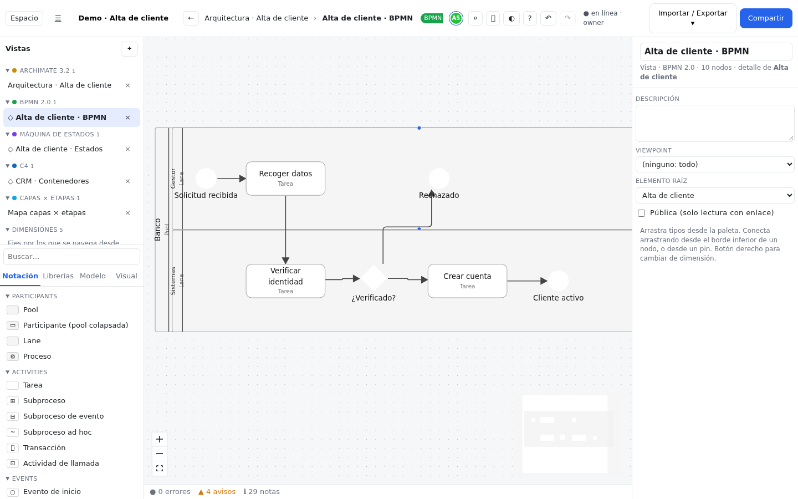

# BPMN 2.0

## Qué es y cuándo usarla {#que-es}

BPMN (*Business Process Model and Notation*) es el estándar para dibujar **procesos**: qué pasos hay,
quién hace cada uno, en qué orden, qué decisiones se toman y qué mensajes se intercambian con otros.
La entiende tanto la gente de negocio como la de sistemas, y muchos motores de procesos la ejecutan.

Úsala para documentar o rediseñar un procedimiento ("alta de cliente", "gestión de una reclamación"),
para acordar responsabilidades entre áreas o para preparar una automatización. Si solo quieres un
algoritmo sencillo sin roles ni mensajes, el [diagrama de flujo](flow.md) es más ligero.

El pack cubre los elementos modelables de BPMN 2.0: procesos, colaboraciones, coreografías y
conversaciones (36 tipos y 6 relaciones).

## Elementos clave {#elementos-clave}

| Elemento | Forma | Qué representa |
|---|---|---|
| **Pool** | Banda grande con el nombre en vertical | Un participante (una empresa, un sistema) con su propio proceso |
| **Lane** | Carril dentro de una pool | Un rol o departamento dentro del participante: "Gestor", "Sistemas" |
| **Participante (pool colapsada)** | Banda vacía | Un participante del que no se detalla el proceso ("caja negra"), por ejemplo el cliente |
| **Tarea** | Rectángulo redondeado | Un paso de trabajo. El campo **Tipo de tarea** (`taskType`: usuario, servicio, script, manual, regla de negocio, envío, recepción) cambia el icono |
| **Subproceso** | Rectángulo con **⊞** | Un paso que a su vez es un proceso. Colapsado se abre con doble clic en su vista de detalle; expandido contiene sus pasos |
| **Evento de inicio** / **de fin** | Círculo fino / grueso | Dónde empieza y dónde termina el proceso. Pueden tener una **Definición de evento** (mensaje, temporizador, error…) |
| **Evento intermedio** | Círculo doble | Algo que ocurre a mitad del proceso: esperar un mensaje, un plazo… |
| **Evento de borde** | Círculo doble pegado a una tarea | Algo que puede interrumpir una tarea (un plazo vencido, un error). Se adhiere con el campo **Adherido a** |
| **Compuerta exclusiva** | Rombo con ✕ | Decisión: se sigue **un solo** camino |
| **Compuerta paralela** | Rombo con ＋ | Todos los caminos a la vez (y espera a todos al juntarlos) |
| **Objeto de datos** / **Almacén de datos** | Hoja / cilindro | Información que se usa o se produce |
| **Anotación** | Corchete con texto | Un comentario sobre cualquier elemento |

También están la compuerta inclusiva, la basada en eventos y la compleja, la actividad de llamada, el
subproceso de evento, el ad hoc y la transacción, y los elementos de coreografía y conversación.

## Relaciones {#relaciones}

| Relación | Línea | Para qué |
|---|---|---|
| **Flujo de secuencia** | Continua con flecha | El orden de los pasos. Campos **Condición** y **Por defecto** (la salida que se toma si ninguna otra se cumple). Es la relación por defecto |
| **Flujo de mensaje** | Discontinua, círculo en el origen | Mensajes entre participantes distintos |
| **Asociación** | Punteada | Une anotaciones, grupos y mensajes con cualquier elemento |
| **Entrada de datos** / **Salida de datos** | Punteada con flecha | Un dato que entra a una tarea / que sale de ella |
| **Enlace de conversación** | Línea doble | Une un participante con una conversación |

## Cómo empezar {#como-empezar}

Así se construye la vista *Alta de cliente · BPMN* de la demo:

1. En el panel **Vistas**, pulsa **＋** y elige **BPMN 2.0**.
2. Arrastra una **Pool** y llámala "Banco". Arrastra dentro dos **Lane**: "Gestor" y "Sistemas".
3. En la lane "Gestor", añade un **Evento de inicio** "Solicitud recibida" y una **Tarea** "Recoger datos"
   (en el inspector, **Tipo de tarea**: *user*).
4. En la lane "Sistemas", añade la tarea "Verificar identidad" (*service*), una **Compuerta exclusiva**
   "¿Verificado?", la tarea "Crear cuenta" y un **Evento de fin** "Cliente activo".
5. Une los pasos en orden arrastrando desde el borde inferior de cada nodo al siguiente y elige **Flujo
   de secuencia** en el selector (sale el primero: es la relación por defecto de BPMN).
6. Saca de la compuerta un segundo flujo hacia otro evento de fin "Rechazado". Pon nombre a las dos
   salidas ("sí" y "no") y, si quieres, una **Condición**.
7. Mira la barra de **problemas** bajo el lienzo: las reglas de BPMN avisan si falta un evento de inicio,
   si un nodo está suelto o si una salida no tiene etiqueta.
8. Para enlazar con la arquitectura: botón derecho sobre la tarea → **Trazas**, o une la tarea con un
   servicio ArchiMate mediante `core:realizes` (ver [relaciones puente](../notaciones.md#relaciones-puente)).

## Reglas de la notación {#reglas}

- **Matriz de validez por roles**: el flujo de secuencia no puede salir de un evento de fin ni llegar a un
  evento de inicio o de borde; el flujo de mensaje sale de tareas, eventos de fin, eventos de
  lanzamiento o pools y llega a tareas, eventos de inicio, de captura o de borde; los datos entran en
  tareas y eventos de lanzamiento y salen de tareas y eventos de captura.
- **Reglas de BPMN que la matriz no puede expresar**:
    - El **flujo de secuencia** une pasos **de la misma pool** (y del mismo subproceso). Al conectar, el
      editor no ofrece flujo de secuencia entre pools distintas.
    - El **flujo de mensaje** une **pools distintas**; nunca dos pasos de la misma. Al conectar dentro de una
      pool no se ofrece.
    - El **evento de borde** va adherido a una actividad: suéltalo dentro de la tarea o subproceso.
    - Una compuerta tiene como mucho **una salida por defecto**; las demás salidas de una compuerta
      exclusiva llevan condición.

  Las tres primeras se comprueban también en todo el modelo con la regla *bpmn-pool-rules* del panel de
  problemas.
- **Anidamiento** sin relación implícita: una pool o una lane contienen lanes, pasos, datos, anotaciones
  y mensajes; un subproceso contiene pasos, datos y anotaciones; un **Grupo** contiene cualquier cosa.
- **Viewpoints**: *Colaboración* (todo), *Proceso* (sin pools, lanes, flujos de mensaje, coreografías ni
  conversaciones) y *Coreografía*.
- **Reglas de bpmnlint**: el panel de problemas aplica 10 reglas de la herramienta bpmnlint (evento de
  inicio y de fin obligatorios, nodos desconectados, compuertas superfluas, etiquetas…) y *bpmn-pool-rules*
  (pools de los flujos y eventos de borde). La lista está en
  [Importar y exportar](../importar-exportar.md#bpmn).

## Importar y exportar {#importar-exportar}

- **BPMN 2.0 XML** (`.bpmn`): importa y exporta con posiciones (DI), así que puedes ir y volver entre
  all-draw y Camunda Modeler, bpmn.io, Signavio y otros. Al exportar el espacio salen todas las vistas
  BPMN; desde una vista, solo esa y sus vistas de detalle. Detalles en
  [Importar y exportar](../importar-exportar.md#bpmn).
- Cada vista también se exporta a SVG, PNG, Mermaid y draw.io ([tabla de formatos](../importar-exportar.md#formatos)).

## Errores comunes {#errores-comunes}

- **Flujo de secuencia entre dos pools**: entre participantes distintos solo hay mensajes. Usa un
  **Flujo de mensaje**.
- **Tareas que se dividen sin compuerta** (*no-implicit-split*): si de una tarea salen dos flujos, pon una
  compuerta para dejar claro si es una decisión o un reparto en paralelo.
- **Compuerta exclusiva sin etiquetas en las salidas**: el lector no sabe qué camino es cuál. Nombra cada
  salida ("sí", "no") o ponle una condición.
- **Abrir con una exclusiva y cerrar con una paralela** (o al revés): el proceso se queda esperando un
  camino que nunca llega. Cierra con el mismo tipo de compuerta que abriste.
- **Modelar el cliente como lane del banco**: si el cliente es otra parte, dibújalo como **Participante**
  aparte y comunícate con él con flujos de mensaje.

## Referencia completa {#referencia}

La lista completa de tipos, relaciones, matriz de validez y viewpoints se genera desde el propio pack:

<!-- docs:notation-ref bpmn -->
