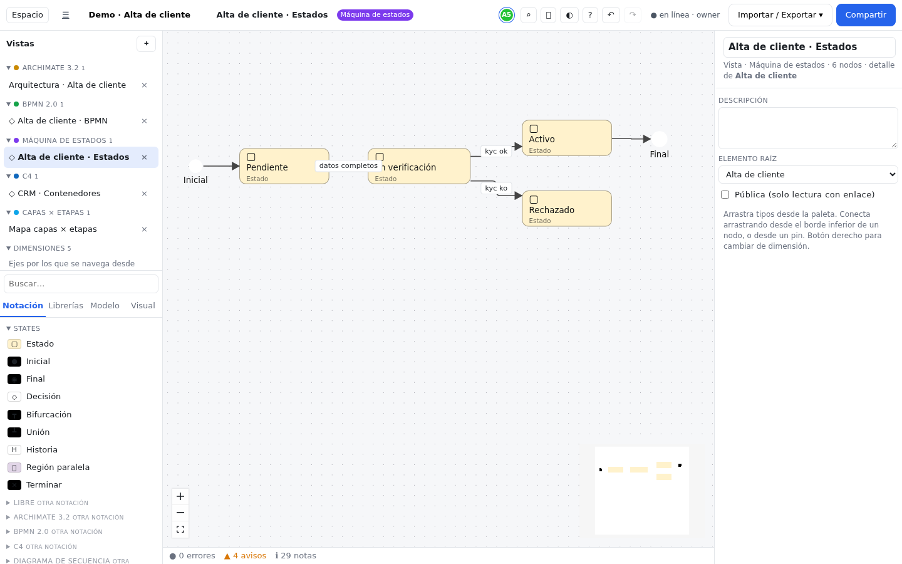

# Máquina de estados

## Qué es y cuándo usarla {#que-es}

Una máquina de estados describe el **ciclo de vida** de una cosa: en qué situaciones (estados) puede
estar y qué la hace pasar de una a otra (transiciones). Por ejemplo, una solicitud de alta está
*Pendiente*, pasa a *En verificación* cuando llegan los datos y termina *Activa* o *Rechazada*.

Úsala para pedidos, cuentas, expedientes, tickets, pantallas de una aplicación o cualquier objeto cuyo
comportamiento dependa de "en qué punto está". Sigue el estilo de los statecharts de UML y de XState:
admite estados dentro de estados y regiones que avanzan en paralelo.

## Elementos clave {#elementos-clave}

| Elemento | Forma | Qué representa |
|---|---|---|
| **Estado** | Rectángulo redondeado | Una situación estable. Si contiene otros estados es un **estado compuesto**. Campos **Entry** y **Exit** (acciones al entrar y al salir) y **Actividades** (lo que se hace mientras dura) |
| **Inicial** | Punto negro | Dónde empieza la máquina (o un estado compuesto). Solo puede ser origen |
| **Final** | Punto con anillo | El fin. Solo puede ser destino |
| **Decisión** | Rombo | Un punto donde se elige el siguiente estado según una guarda |
| **Bifurcación** / **Unión** | Barra negra | Reparte una transición hacia varias regiones / las vuelve a juntar |
| **Región paralela** | Rectángulo de borde discontinuo | Una parte que avanza a la vez que otras dentro del mismo estado |
| **Historia** | Círculo con H | Vuelve al último subestado en el que se estaba (`H*`, si se marca **Profunda**) |
| **Terminar** | Círculo con X | Detiene la máquina por completo |

## Relaciones {#relaciones}

Solo hay una: la **Transición** (flecha continua). Sus campos forman la etiqueta clásica
`evento [guarda] / acciones`:

| Campo | Para qué | Ejemplo |
|---|---|---|
| **Evento** (`event`) | Lo que dispara el cambio | `kyc ok` |
| **Guarda** (`guard`) | Condición que debe cumplirse | `importe < 1000` |
| **Acciones** (`actions`) | Lo que se ejecuta al cambiar, una por línea | `enviar email` |
| **Retardo** (`delay`) | Transición temporizada | `after 500ms` |
| **Interna** (`internal`) | La transición no sale del estado (no ejecuta entry/exit) | |

## Cómo empezar {#como-empezar}

Así se construye la vista *Alta de cliente · Estados* de la demo:

1. En el panel **Vistas**, pulsa **＋** y elige **Máquina de estados**.
2. Arrastra un **Inicial** y cuatro **Estado**: "Pendiente", "En verificación", "Activo" y "Rechazado".
   Añade un **Final**.
3. Une el inicial con "Pendiente": arrastra desde el borde inferior de uno al otro y elige **Transición**
   en el selector (sale la primera).
4. Une "Pendiente" con "En verificación" y, con la transición seleccionada, escribe en el inspector el
   **Evento** `datos completos`.
5. Une "En verificación" con "Activo" (evento `kyc ok`) y con "Rechazado" (evento `kyc ko`).
6. En "En verificación", rellena **Entry** con `lanzar KYC`.
7. Une "Activo" con el **Final**.

Para un estado compuesto, arrastra estados *dentro* de otro estado; para regiones paralelas, mete dos
**Región paralela** dentro del estado compuesto y cada subestado dentro de su región.

## Reglas de la notación {#reglas}

- **Pseudoestados con sentido**: el inicial solo sale (hacia un estado, una decisión o una
  bifurcación); el final y terminar solo reciben; una bifurcación reparte hacia estados o regiones; la
  historia solo apunta a un estado.
- **Anidamiento sin relación**: los estados compuestos y las regiones se expresan metiendo nodos
  dentro de un **Estado** o de una **Región paralela**. No se crea ninguna relación al anidar.
- La matriz de validez solo ofrece **Transición** entre los pares permitidos. En los demás casos (por
  ejemplo, desde un final) el selector solo muestra las relaciones puente del núcleo, que no son
  transiciones.

## Importar y exportar {#importar-exportar}

- **XState JSON**: importa y exporta estados (también anidados y paralelos), eventos, guardas, acciones,
  retardos y transiciones internas. El fichero no guarda posiciones: al importar se colocan solas.
- **Mermaid `stateDiagram-v2`**: importa y exporta, con estados compuestos, regiones paralelas y
  decisiones.
- Detalles y limitaciones en la [tabla de formatos](../importar-exportar.md#formatos).

## Errores comunes {#errores-comunes}

- **Poner la condición en el nombre de la transición** en vez de en **Evento** y **Guarda**: se ve
  igual, pero XState y Mermaid no la exportan como tal.
- **Estados que son acciones** ("Enviar email"): un estado es una situación ("Esperando
  confirmación"); la acción va en la transición o en **Entry**.
- **Olvidar el inicial** dentro de un estado compuesto: no queda claro en qué subestado se entra.
- **Usar Decisión para esperar un evento**: la decisión se resuelve al instante con guardas; si hay que
  esperar, es un estado.

## Referencia completa {#referencia}

La lista completa de tipos, relaciones, matriz de validez y viewpoints se genera desde el propio pack:

<!-- docs:notation-ref statechart -->
